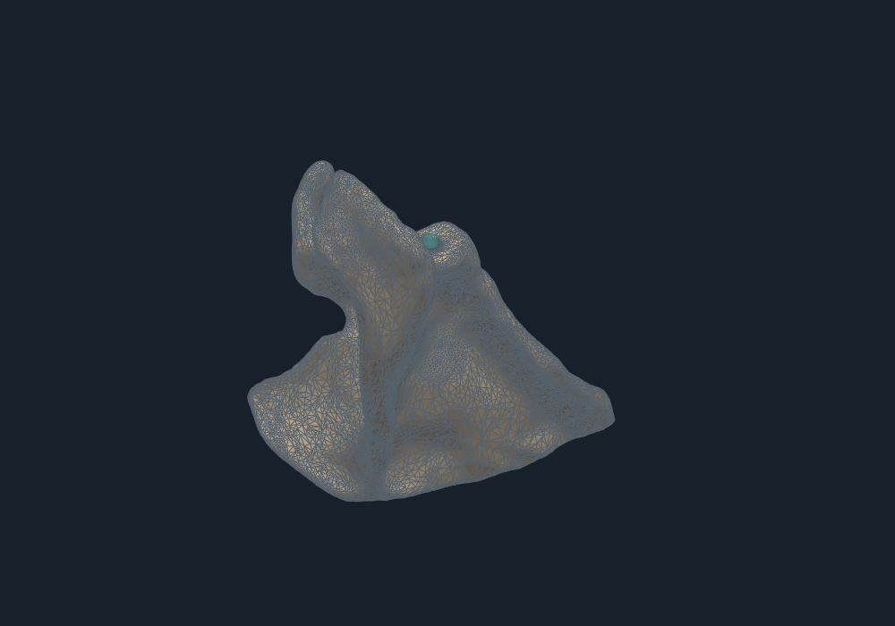

# 12-紧凑短边修复四预算终态与真实GPU像素交付

生成时间：2026年10月06日20时18分05秒（北京时间）  
修改时间及修改内容：2026年10月06日20时26分40秒，补充完整主包与运行库名称补包1,225成员实际核对、D盘保存和复现边界；首次生成登记同源48配对、三轮完整四预算反馈、507实际保存对象复审和48帧真实GPU像素交付。

文档概述：继续压缩实时流程中的必要处理。原生短边宽筛和直接覆盖查询减少准备、数组复制成本；全部几何、拓扑、来源、锚点和全域碰撞守卫保留。100毫秒档能够完整反馈，但存在超预算，整体像素交付仍为数百毫秒，实时目标未完成。

## 索引目录

1. 实际改动与方法身份
2. 同源组件对照
3. 完整四预算GPU反馈
4. 质量收益
5. 真实GPU像素交付
6. 复现与证据
7. 与另两条线路的连接及剩余工作

## 1. 实际改动与方法身份

新私有执行目录为`/tmp/compact_short_repair_20261006`，继承11号的确定性交叉输入Geogram、原精确父证书和CUDA稳定边索引。没有调用完整PaMO；沿用的PaMO虚拟环境只提供Python/Torch运行依赖。

新增`native_short_edge_scan.cpp`一次遍历全部面，生成全域包围盒及保守短边候选。两倍容差立方体只是宽筛，最终仍用原FP64 NumPy范数、去重和排序决定候选。支持的正常容差范围避免范数平方的极端下溢、上溢；实际固定容差为1e-10毫米。

`short_edge_repair_compact.py`查询退化映像的同标签点、边覆盖时，直接查询未改动全域面和替换星形面，避免每个候选复制整个保留网格。未裁剪外部障碍；父锚点、全局及逐标签链接、准确分数位移界、替换面之间及与全域面分离、超时回滚均保持。

冻结工作器中的`short_edge_repair.py`是新版本，`short_edge_repair_reference.py`是逐字节保留的旧版本。原始目录、11号已有失败、其他线路冻结算法与判据不改。

## 2. 同源组件对照

16份实际保存CT切削源，各三轮交错配对，共48对。足量预算下候选集合、包围盒数值、输出数组、操作、拒绝理由、保留面身份和准确误差上界逐项一致。16份实际修复输出通过完整精确闭合嵌入检查；另有五组容差边界、重复点、负零及尺度候选对照和既有五项短边控制。

| 同输入组件中位耗时 | 旧版 | 紧凑版 |
| --- | ---: | ---: |
| 必需短边修复 | 48.796 ms | 18.161 ms |
| 其中准备阶段 | 19.995 ms | 3.185 ms |

实测组件中位约2.69倍，不能直接作为整帧加速倍数。这是已见保存源的等同对拍，不是任意输入证明。

## 3. 完整四预算GPU反馈

两方法各三轮，每轮从同一原始CT和16工具重新开始，按旧/新、新/旧、旧/新交错执行；总分母384计划事件。每条路线沿它自己的实际合法父网格继续，超预算单列，非法源之后保留受阻事件。

| 方法 | 维护预算 | 发布/计划 | 发布且在预算内 | 拒绝 | 受阻 |
| --- | ---: | ---: | ---: | ---: | ---: |
| 旧修复 | 20 ms | 3/48 | 0/48 | 3 | 42 |
| 旧修复 | 50 ms | 3/48 | 0/48 | 3 | 42 |
| 旧修复 | 100 ms | 3/48 | 2/48 | 3 | 42 |
| 旧修复 | 200 ms | 48/48 | 46/48 | 0 | 0 |
| 紧凑修复 | 20 ms | 3/48 | 0/48 | 3 | 42 |
| 紧凑修复 | 50 ms | 3/48 | 0/48 | 3 | 42 |
| 紧凑修复 | 100 ms | 48/48 | 40/48 | 0 | 0 |
| 紧凑修复 | 200 ms | 48/48 | 47/48 | 0 | 0 |

| 完整路线 | 维护均值 | 维护P95 | 切削加维护均值 | 切削加维护P95 |
| --- | ---: | ---: | ---: | ---: |
| 旧修复200档 | 152.516 ms | 177.009 ms | 278.871 ms | 433.521 ms |
| 紧凑修复100档 | 96.909 ms | 111.806 ms | 234.593 ms | 382.671 ms |
| 紧凑修复200档 | 129.906 ms | 176.024 ms | 280.915 ms | 570.386 ms |

100档的最大维护耗时333.795毫秒，200档为328.541毫秒。不能把均值低于预算写成每帧保证。20/50档必要原子认证已超过预算，且后续源未修复成功，不算完整实时路线。

六批全部507份实际保存对象完成全量复审，包括原始CSG、修复源、发布输出和拒绝输入。全部159份实际发布输出及对应准备源闭合嵌入，父链核对通过；原始CSG和拒绝对象中的非法结果保留，不能称507份全部合法。

200档维护均值下降，但整帧均值没有下降，P95反而变差。各自实际质量操作和父网格不同，又使用共享资源，不据此宣称隔离条件下的整帧加速优势。

## 4. 质量收益

质量统一比较同次准备源和它的实际输出，包含所有正面积面，用小于10°、5°、1°面数与面积口径。

紧凑100档48帧没有可选质量翻边，质量阶段不增加延迟；必要短边修复的收益另记，不能与可选翻边混算。

紧凑200档实际提交16次翻边，小于10°/5°/1°面数累计分别减少14/14/16，改善帧分别8/8/10。面积改善帧分别2/2/10，小于10°面积有2帧出现负向浮点差异，全部原值保留。整体收益很小，未称全面质量优势或达到PaMO质量水平。旧200档10次实际翻边，父链不同，不能直接比较累计收益来作机制因果结论。

## 5. 真实GPU像素交付

独立准备PyVista0.48.4、VTK9.5.2和私有EGL前端，未替换共享环境或驱动。首轮镜像慢下载中断日志及失败状态保留；恢复使用本机从官方取得并核对摘要的VTK轮子，三个GPU反馈批次实际执行终态。

实际EGL及OpenGL能力字符串确认NVIDIA渲染器。每帧渲染1000×700像素、核对数组摘要和非空像素，保存48份实际数组及48张帧缓冲；48份显示数组完整精确复审通过。首帧实际渲染成本包含在计时中。

| 实际显示批次 | 帧数 | 切削开始到像素均值 | P95 | 渲染及读取中位 |
| --- | ---: | ---: | ---: | ---: |
| 旧修复200档 | 16/16 | 316.703 ms | 450.660 ms | 22.107 ms |
| 紧凑修复200档 | 16/16 | 276.076 ms | 381.119 ms | 23.149 ms |
| 紧凑修复100档 | 16/16 | 291.257 ms | 555.098 ms | 22.556 ms |

这三批仅各一次，共享设备且实际父链不同；100档在该显示批次并没有比200档稳定更快。不同结果如实报告，不选择最好帧或最好批次作为固定能力。

这是GPU离屏帧缓冲交付，不包含客户端网络、Qt交互和屏幕扫描呈现。实验中的离线PNG保存、证据记录等使实际像素交付间隔均值分别530.568、488.117、514.074毫秒，因此不能将单帧时延的倒数直接写成该实验的连续更新帧率。

Linux EGL选择参考[VTK运行时设置](https://docs.vtk.org/en/v9.5.2/advanced/runtime_settings.html)。当前成果是获得实际显示成本，不代表已满足手术实时应用延迟。



## 6. 复现与证据

实际终态汇总：[27-紧凑短边修复三轮四预算与真实GPU像素终态](诊断证据/27-紧凑短边修复三轮四预算与真实GPU像素终态.json)。其中绑定六批完整账本与复审摘要、48对同源结果和三批像素证据。

完整主包及继承动态库名称补包现已转存D盘，共1,225成员，逐成员大小、SHA256和CRC实际核对通过。主包只登记继承库主名称，补包从11号原冻结归档取出相同字节的SONAME和版本名称，核对与主包中的库摘要一致；恢复需同时使用两包。

| 归档 | 成员 | 字节 | SHA256 |
| --- | ---: | ---: | --- |
| [05-完整主包](D:/GraduationProject实验输出/20261006_实时预算局部质量算法/Linux完整连续与资源诊断证据/05-紧凑短边修复四预算与GPU像素完整证据.zip) | 1,221 | 780,506,341 | `f13d575dff2e095d6435fcdbb5a38969b0261adaf1e9c062202fa4cfb9ef4569` |
| [06-动态库名称补包](D:/GraduationProject实验输出/20261006_实时预算局部质量算法/Linux完整连续与资源诊断证据/06-紧凑修复继承Geogram动态库名称补充.zip) | 4 | 9,811,561 | `bba4faf45400fed3a829196cdc485e26148d87b909599b574bce46bb5550f5b0` |

主包包含六批完整输出、拒绝/受阻与保存复审、实际生成工作器、原生库、初态和工具、全部像素与显示数组、实际渲染依赖完整轮子及EGL前端。Python字节码缓存和解包Python依赖目录不保存，后者由同摘要的完整轮子恢复；系统驱动和基础Python/Torch/Trimesh等环境另备。首次慢下载的中断现场、恢复脚本和结果分别保留。

凭据：[29号远端归档](诊断证据/29-紧凑修复与GPU像素完整远端归档回执.json)、[30号继承库绑定](诊断证据/30-继承Geogram动态库名称补充与原包绑定.json)、[31号本机逐成员核对](诊断证据/31-紧凑修复完整主包与运行库补包本机逐成员核对.json)、[32号D盘保存](诊断证据/32-紧凑修复完整主包与运行库补包D盘保存回执.json)。

恢复时先核对两ZIP摘要，再在没有同名活动批次的新实例解压到`/tmp`，保持两包中的原目录结构。禁止覆盖当前活动实例的公共库或旧证据。初态、工具、实际库及工作器摘要需与封存记录匹配；Python运行依赖按实际版本准备。下面输出目录必须不存在，使用主包中的冻结工作器，不使用工作区后来版本：

```bash
env LD_PRELOAD=/usr/lib/x86_64-linux-gnu/libstdc++.so.6 \
  /path/to/verified/python \
  /tmp/compact_short_repair_20261006/workers/verified_budget_feedback.py \
  --ct-record /tmp/geogram_certified_pairs_20261006_r3/inputs/ct_record.json \
  --output /tmp/compact_replay_new_output \
  --budgets 20 50 100 200 --fixed-flip-certificate --early-quality-return \
  --edge-backend cuda --certified-operand-pairs
```

随后用同一冻结`audit_verified_budget_feedback.py --root /tmp/compact_replay_new_output`复审新保存对象。渲染还需从`render_trials_retry2/wheels`向原私有`python_deps`路径安装封存轮子，并按同次执行记录设置私有EGL路径和`VTK_DEFAULT_OPENGL_WINDOW=vtkEGLRenderWindow`，先核实实际NVIDIA能力字符串。恢复说明不是在全新系统上实际复跑的证明。

执行代码：`run_compact_repair_trials.py`、`verify_compact_short_repair.py`、`run_private_gpu_render_trials.py`、`render_live_gpu_feedback.py`、`collect_compact_repair_results.py`和`archive_compact_repair_evidence.py`。冻结实际生成工作器与源码是复现依据，不能用后来同名文件替代。

## 7. 与另两条线路的连接及剩余工作

质量线路[212号](../Geogram与PaMO组合验证/212-Geogram共享边竞争生成真实CT十六刀终态与完整复审.md)提供同来源竞争选择和几何界参考，仍不能将其数十至数百秒的全量生成直接接入实时入口。当前紧凑版继续保留数学正面积小面，未修改那条线路的冻结面积门槛。

长期线路新增[57号](../../课题规划与专题调研/57-退化面局部清理层与完整精确复审接入.md)：旧第68步候选拒绝源局部翻边能够恢复完整嵌入，新方法从旧67步合法前缀分叉后取得3步接续，后缀继续运行。旧前缀与新机制身份分开；它不能代替本线路从初态进行几千、上万次更新验证。后续复用56号事件账本、恢复与参照接口，保持在线时钟与离线评价分开。

本轮证明了必需短边修复可以在等同条件下大幅减少组件成本，并使100毫秒档完整反馈成为可能。实时目标仍需继续优化Geogram切削和源认证，压低尾延迟；还需新输入、实际交互显示和本算法的长序列稳定性。GPU保持开启，活动目标未宣布完成。
