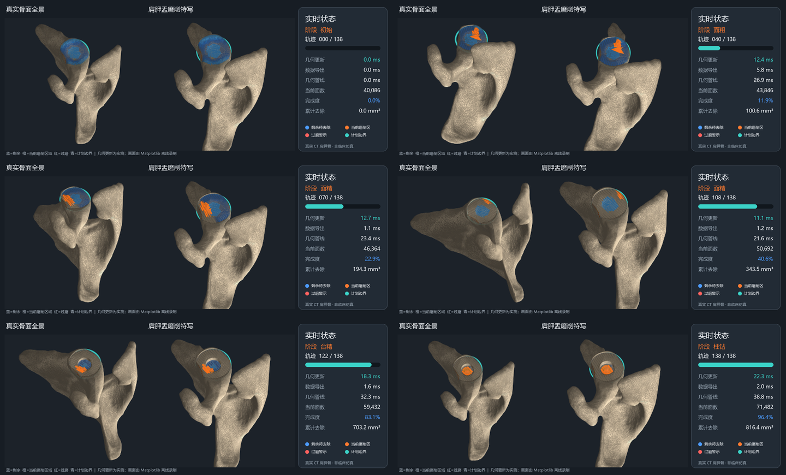

# 08-真实骨面驻留式系统演示与性能验证（对应旧版三项研究工作 v1）

> **生成时间**：2026-09-04 19:34:11（北京时间）
>
> **修改时间及修改内容**：
> - 2026-09-04 19:34:11 首次生成：记录真实 CT 肩胛骨上的 manifold3d 内核驻留式增量更新、实际系统演示、分项延迟、几何一致性、网格质量和论文表述边界。
>
> **文档概述**：本文档记录 `hill_sachs_001_F_37_R` 真实 CT 重建肩胛骨上的 138 步五相位磨削实验。实验把骨网格持续保留在 manifold3d 内核中，避免每步在 Trimesh 与布尔内核之间完整往返，并生成真实骨面全景、肩胛盂特写、状态面板、GIF、关键帧、逐步时序 CSV 和最终 PLY。结果证明几何更新本身满足当前 30 Hz 目标，但包含工具构造、网格导出和逐步质量指标的完整 Python 几何管线尚未稳定满足 30 Hz；Matplotlib 仅用于离线录制，不作为实时渲染结论。

## 索引目录

- [一、实验目的与结论](#一实验目的与结论)
- [二、数据、环境与实现](#二数据环境与实现)
- [三、实测结果](#三实测结果)
- [四、实际演示系统效果](#四实际演示系统效果)
- [五、可用于论文的表述](#五可用于论文的表述)
- [六、限制与下一步](#六限制与下一步)
- [七、产出文件](#七产出文件)

---

## 一、实验目的与结论

本实验属于工作一“磨削表面增量更新”与工作二“实时可视化原型”的连接验证，目标是确认 E5-lite 的内核驻留优化能否实际用于真实骨面演示，而不只是独立性能脚本。

当前结论如下：

1. 真实 CT 肩胛骨上的 138 步增量磨削完整运行，最终完成度为 96.43%，最终网格水密且绕序一致。
2. manifold3d 内核中的纯几何更新平均 13.6 ms、P95 22.1 ms、最大 25.9 ms，138 步均低于 33.3 ms，满足当前 30 Hz 几何更新目标。
3. 工具构造、几何更新、网格导出和逐步指标合计的几何管线平均 25.5 ms、P95 38.7 ms、最大 43.6 ms，其中 16/138 步超过 33.3 ms。因此不能宣称当前完整 Python 管线稳定达到 30 Hz。
4. Matplotlib 录制平均约 516 ms/帧，仅用于生成论文图片和答辩 GIF，不属于实时渲染实现。
5. 最终网格仍包含 465 个零面积三角形，是下一步 E6 网格质量维护的明确对象。

## 二、数据、环境与实现

### 2.1 数据与场景

- 模型：`hill_sachs_001_F_37_R` 右侧肩胛骨。
- 数据性质：项目现有记录标注为真实 CT 重建网格；来源记录为 Zenodo 14590062、犹他大学 Henninger 实验室数据集。本次未重新联网核验数据页面。
- 初始规模：40,086 个三角形，输入网格水密。
- 计划定位：使用现有数据记录中的盂中心标志点 GC，并在 9 mm 邻域拟合盂面法向。
- 计划结构：基板贴附面、中央凸台和中央柱。
- 工具与轨迹：球形磨钻，面粗、面精、台粗、台精和柱钻共 138 步。
- 单位：距离与体积分别使用 mm 和 mm³。

### 2.2 运行环境

| 项目 | 配置 |
|---|---|
| 操作系统 | Windows 11 家庭版中文版，10.0.26200 |
| CPU | Intel Core Ultra 5 225H，14 核/14 逻辑处理器 |
| 内存 | 31.5 GB |
| Python | 3.13.14 |
| NumPy / SciPy | 2.5.2 / 1.18.1 |
| Trimesh | 5.1.0 |
| manifold3d | 3.5.2 |
| Matplotlib / Pillow | 3.11.1 / 12.3.0 |
| GPU | 本实验未使用 GPU |

### 2.3 实现方式

原始基线每一步都执行“Trimesh 转 Manifold—布尔差—转回 Trimesh”。本实验改为：

1. 初始骨网格只转换一次并常驻 manifold3d；
2. 每步只构造并转换当前工具扫掠体；
3. 在 manifold3d 内执行布尔差并强制求值；
4. 为显示和统计导出当前 Trimesh，但导出结果不再作为下一步布尔输入；
5. 最终以保留共享顶点索引的 PLY 保存结果。

该方案减少了不断膨胀的骨网格在 Python 与 C++ 内核之间重复转换和重新三角化的成本。它是“内核驻留式增量更新”，不是空间局部子网格更新。

## 三、实测结果

### 3.1 几何与拓扑结果

| 指标 | 结果 |
|---|---:|
| 轨迹步数 | 138 |
| 初始面数 | 40,086 |
| 最终面数 | 71,482 |
| 实际去除体积 | 816.424704 mm³ |
| 计划完成度 | 96.43% |
| 最终水密性 | 通过 |
| 最终绕序一致性 | 通过 |
| 零面积三角形 | 465 |

独立 E5-lite 对拍中，驻留路线与逐步 Trimesh 往返基线的最大逐步体积偏差为 0.000070 mm³；每侧固定采样 20,000 点的双向表面距离最大值为 0.000007 mm。该结果说明两条路线在当前测试中的几何输出一致，性能差异主要来自表示往返与重复三角化。

### 3.2 延迟分解

| 模块 | 平均耗时 | P95 | 最大值 |
|---|---:|---:|---:|
| 工具构造 | 3.0 ms | 4.5 ms | 6.4 ms |
| manifold3d 几何更新 | 13.6 ms | 22.1 ms | 25.9 ms |
| 当前网格导出 | 1.4 ms | 2.2 ms | 2.8 ms |
| 体积与网格质量指标 | 7.5 ms | 10.6 ms | 12.7 ms |
| 几何管线合计 | 25.5 ms | 38.7 ms | 43.6 ms |

几何更新单项 138/138 步低于 33.3 ms；几何管线合计有 16/138 步超过 33.3 ms，约 88.4% 的步骤满足 30 Hz 预算。后续优化应优先降低逐步质量指标频率或把指标计算移出更新关键路径，而不是立即进入 GPU 移植。

## 四、实际演示系统效果

演示画面由三个区域组成：

1. 左侧为真实肩胛骨全景，用于保留解剖上下文；
2. 中间为肩胛盂磨削特写，用于观察计划区和当前加工状态；
3. 右侧为状态面板，显示磨削阶段、轨迹进度、几何更新耗时、数据导出耗时、几何管线耗时、当前面数、完成度和累计去除体积。

颜色语义固定为：蓝色表示剩余待去除区域，橙色表示当前磨削区域，红色表示过磨警示，青色表示计划边界。完整 138 步均参与计算，GIF 抽取 23 个包含均匀步骤和相位边界的代表帧。

## 五、可用于论文的表述

建议在论文中使用以下谨慎表述：

> 在一例真实 CT 重建肩胛骨网格及 138 步仿真磨削轨迹上，采用 manifold3d 内核驻留策略后，纯几何更新平均耗时为 13.6 ms，P95 为 22.1 ms，最大值为 25.9 ms，满足 30 Hz 的几何更新预算。包含工具构造、网格导出和逐步指标统计的几何管线平均耗时为 25.5 ms，但 P95 为 38.7 ms，尚未稳定满足 30 Hz。最终网格保持水密，驻留路线与逐步 Trimesh 往返基线的最大逐步体积偏差为 0.000070 mm³。

不应使用以下扩大化表述：

- “完整系统已经稳定达到 30 fps”；
- “Matplotlib 可视化已经实时运行”；
- “已经完成局部子网格增量算法”；
- “已经验证临床有效性”；
- “单个真实骨模型能够代表不同患者和不同轨迹条件”。

## 六、限制与下一步

### 6.1 当前限制

1. 当前只有一例真实骨模型和一条固定轨迹，不能据此给出跨个体泛化结论。
2. Matplotlib 为离线录制手段，尚未接入 VTK/PyVista 等交互渲染循环。
3. 逐步质量统计进入关键路径，使完整几何管线 P95 超过 33.3 ms。
4. 最终存在 465 个零面积三角形，需评估其空间位置、产生阶段及清理后的几何偏差。
5. 当前优化是内核驻留，不是 AABB/KD 树加局部回拼；后者的真实骨复杂拓扑稳定性尚未解决。

### 6.2 紧接着的工作

1. 将体积和网格质量统计改为降频计算或异步计算，再测完整几何管线是否稳定低于 33.3 ms。
2. 开展 E6 网格质量维护：定位零面积三角形的首次出现步骤，比较删除、简化或局部重网格方案，并要求表面偏差增量小于 0.05 mm。
3. 在第二例以上真实骨模型及不同轨迹参数上重复运行，形成规模和个体差异证据。
4. 几何管线稳定后，再接入 VTK/PyVista 交互显示并单独测量渲染和端到端延迟。

## 七、产出文件

- 实现：`初步实验/真实骨模型演示/real_bone_system_demo.py`
- 演示 GIF：`初步实验/真实骨模型演示/驻留式系统演示/真实骨面驻留式系统演示.gif`
- 关键帧：`初步实验/真实骨模型演示/驻留式系统演示/真实骨面驻留式系统关键帧.png`
- 全部 138 步时序：`初步实验/真实骨模型演示/驻留式系统演示/resident_system_timing.csv`
- 运行摘要：`初步实验/真实骨模型演示/驻留式系统演示/resident_system_summary.txt`
- 最终索引网格：`初步实验/真实骨模型演示/驻留式系统演示/真实骨面驻留式最终网格.ply`

以上文件均由同一轮 2026-09-04 19:33:09（北京时间）实验生成；关键帧和 GIF 为抽帧展示，CSV 保留全部步骤。
