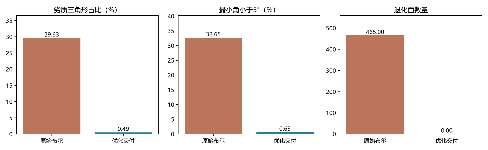
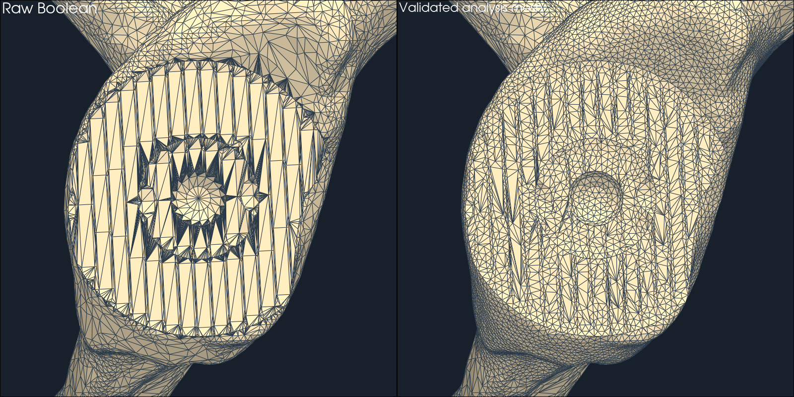

# 10-动态骨面网格质量质疑与交付优化实验报告

> **生成时间**：2026-09-07 01:46:28（北京时间）
> **修改时间及修改内容**：2026-09-07 01:46:28，由实验数据生成首次交付报告，记录质疑、优化、失败案例、验证及限制。
> **文档概述**：回应磨削后细长三角形是否适用于下游分析的质疑，交付带质量验收的局部重网格分析副本，并修正计划完成度与风险面积口径。实验是单标本非临床仿真。

## 索引目录

- [一、质疑与结论](#一质疑与结论)
- [二、方法与验收](#二方法与验收)
- [三、实验设计与环境](#三实验设计与环境)
- [四、实际结果](#四实际结果)
- [五、下游指标与性能](#五下游指标与性能)
- [六、使用和复现](#六使用和复现)
- [七、限制与后续研究](#七限制与后续研究)
- [八、依据与证据文件](#八依据与证据文件)

## 一、质疑与结论

用户在线框显示中观察到长条、尖角和密集扇形面，质疑动态骨面能否交付下游分析。质疑成立：此前水密性和绕序检查只验证部分拓扑条件，不能替代形状质量、自相交和数值适用性验证。

本次实现了暂停检查点上的局部重网格、质量验收、原始/优化副本切换与双份导出。原始布尔骨面仍是后续磨削的计算状态；优化副本用于查看和导出，下一步磨削会使旧副本失效。没有实现每帧实时重网格，也没有验证实体有限元求解。

## 二、方法与验收

复用 PyMeshLab 的局部各向同性重网格。默认盂中心22 mm邻域、目标边长0.6 mm、3次迭代、30°特征角、每个局部操作0.05 mm表面偏差约束。该偏差参数不是最终严格豪斯多夫上界。算法包含分边、塌边、翻边和顶点调整；再以manifold3d进行1e-5 mm容差简化，重新检查几何与拓扑。

预处理合并重复顶点、删除零面积面；只允许原本水密输入清理产生的边长不超过0.001 mm的微小三边孔进行自动补合。修复后必须水密，否则拒绝。初次孔边数阈值设置使微孔未闭合，实验已拒绝；修正后复跑。另一组试验只做重网格仍检出自相交，最终增加了微小容差简化与自相交验收。这些失败数据保存在单独JSON中。

交付门槛是本课题的工程试验阈值，不是临床标准：水密、绕序一致、欧拉示性数不变；面积≤1e-12 mm²的面为0；检测到的自相交面为0；q<0.1的面占比低于5%且不高于输入；双向顶点+面积采样最大距离≤0.1 mm；绝对体积变化≤5 mm³。q=4√3 A/(a²+b²+c²)，等边为1。

## 三、实验设计与环境

本机Windows、Intel Core Ultra 5 225H；Python 3.13.14，项目`.venv`。PyMeshLab 2025.7.post1、manifold3d 3.5.2、Trimesh 5.1.0、VTK 9.6.2。未运行GPU更新。骨面来源沿用项目中真实CT肩胛骨标本hill_sachs_001_R，来源仍以08号记录为准，本次未新增临床数据或复核下载来源。

输入SHA256：`8e9974dc46b293766bd6d433c54096390ff226082854d66f0dfef37f75460309`。

实验覆盖初始网格和138步真实轨迹，取60、110、138步检查点；最终状态比较0.6 mm/3次、0.6 mm/5次、0.9 mm/3次，并重复默认方案3次。三次重复只支持初步耗时/一致性观察，不代表小时级稳定性。

误差计算包含每个方向的全部顶点和10,000个面积均匀样本，固定种子20260907，记录均值、P95、P99、最大值与超0.1 mm事件。额外使用种子91827、每方向50,000个样本加全部顶点复核最终副本，并用Trimesh最近点计算500个样本作实现交叉核验。所有距离都是相对原始布尔表面的抽样/顶点检验，不是相对真实手术切削表面的准确度，也不是连续表面严格上界。

解析测试使用体积1000 mm³的盒体和500 mm³计划去除区，分别验证初始、仅误切、仅计划切除、两者均有四种情况。另验证同一平面细分后面数增长16倍而面积与表面距离不变，以及等边三角形q=1。

## 四、实际结果

|指标|原始138步|默认优化副本|
|---|---:|---:|
|三角形数|71482|54210|
|q均值|0.4859|0.8005|
|q的P5|0.00202|0.40914|
|q<0.1占比|29.633%|0.493%|
|最小角<5°占比|32.649%|0.627%|
|退化面|465|0|
|水密/绕序一致|True/True|True/True|
|复载自相交检测面数|未作为合格基线|0|





|运行|面数|q<0.1占比%|双向观测最大距离mm|体积变化mm³|处理+验收秒|通过|
|---|---:|---:|---:|---:|---:|---|
|step138_edge0.6_iter3|54210|0.493|0.07693|1.141|16.02|True|
|step138_edge0.6_iter5|53606|0.405|0.09521|2.247|16.63|True|
|step138_edge0.9_iter3|44672|0.466|0.09041|2.798|12.18|True|
|step60_edge0.6_iter3|52170|0.311|0.06838|1.065|2.37|True|
|step110_edge0.6_iter3|53148|0.408|0.07673|0.063|4.92|True|
|step138_edge0.6_iter3_repeat5|54210|0.493|0.07693|1.141|15.51|True|
|step138_edge0.6_iter3_repeat6|54210|0.493|0.07693|1.141|15.34|True|

默认方案原始→优化：均值0.001969 mm，P95 0.009107，P99 0.026824，最大0.076927。优化→原始：均值0.000099，P95 0.000003，P99 0.002764，最大0.049193。两个方向超0.1 mm事件共0个。

加密采样的双向观测最大距离为0.076927 mm。24 mm邻域外原始顶点到优化顶点的最大距离为0.00000000 mm。后者只核验顶点位置，不宣称所有远区连接索引完全不变。

## 五、下游指标与性能

完成度现在为“计划内已去除体积/计划应去除体积”；计划外误切单独计量。真实轨迹最终总去除816.424704 mm³，其中计划内816.206703、计划外0.218001，修正完成度96.40151%。解析测试中仅误切200 mm³时完成度为0%，计划全部切除且额外误切200 mm³时为100%，不会虚增为140%。

优化副本重新求交后完成度为95.99749%，相对原始差-0.40401个百分点；计划外去除体积从0.218028变为2.497917 mm³。这说明小的几何偏差仍会影响接近计划边界的风险计量，不能把副本未经验证地回灌为真实磨削状态。界面仍显示原始计算状态的体积指标，优化副本面数在质量说明中单列。

风险面数已改为带单位的面积。当前面积是面心分类乘面面积的近似积分，不能声称完全不依赖剖分：本次剩余面积从91.35176变为91.09827 mm²，近计划过磨面积从11.34479变为10.88497 mm²。近计划过磨面积只覆盖既有0.30 mm邻带；深层误切由计划外去除体积补充表达。面积差同时包含重网格几何变化与积分变化，未完成独立的网格收敛试验，应保留≈标识。

加入计划实体求交后，138步几何更新平均13.17 ms、P95 19.83、最大23.98；完整几何管线平均57.74 ms、P95 97.89、最大114.62，超过33.3 ms 138步。准确计量增加了开销，不能沿用旧版25 ms管线结论。

默认最终状态重网格+验收共3次：平均15.62秒、P95 15.97秒、最大16.02秒。此处P95仅是3个数的描述性分位数，不是可靠尾延迟估计。重网格在后台执行，暂停几何推进；相机仍可观察。它不满足每帧重网格目标。

## 六、使用和复现

在交互程序中暂停到需要的步骤，点击“优化当前网格（分析交付）”，等待质量验收结果。通过后可以切换原始/优化网格，并以骨面+三角边观察。导出同时保留原始PLY、优化PLY、逐步CSV与质量验收JSON；未通过时不导出合格分析副本。继续单步或重置后需要重新优化。

```powershell
cd C:\Users\24848\Desktop\GraduationProject
uv pip install --python .\.venv\Scripts\python.exe -r .\初步实验\真实骨模型演示\requirements_interactive.txt
.\.venv\Scripts\python.exe .\初步实验\真实骨模型演示\test_quality_delivery.py
.\.venv\Scripts\python.exe .\初步实验\真实骨模型演示\quality_experiment.py
.\.venv\Scripts\python.exe .\初步实验\真实骨模型演示\quality_report.py
.\.venv\Scripts\python.exe .\初步实验\真实骨模型演示\real_bone_interactive_app.py
```

## 七、限制与后续研究

仍有0.493%劣质面，最小角仍可很小，不能称为全局等边网格或通用有限元就绪模型。未开展材料建模、体网格生成、力学求解、接触收敛或临床评价。特征保护与距离验收有助于保留台阶，但尚未单独建立孔径/边缘位置的解析真值试验。

本次完成的是可检查、可导出的质量优化与指标修正。下一阶段应把维护限制到单步受影响邻域，研究触发频率和累计误差；以面积/深度积分收敛、长序列稳定性及端到端时延作为进一步验收条件。现有三次重放不替代长序列维护验证。

## 八、依据与证据文件

实现依据为官方PyMeshLab文档（软件说明，不是临床证据）：https://pymeshlab.readthedocs.io/en/latest/filter_list.html#meshing-isotropic-explicit-remeshing 。网格质量的用途相关性可参见作者页面：https://www.cs.cmu.edu/~jrs/jrspapers.html 。来源检索沿用本次对话已核对资料。

原始实验数据在`初步实验/真实骨模型演示/网格质量交付实验/`：`results.json`、`analytic_tests.json`、`independent_validation.json`。失败探索保留于`failed_hole_threshold_results.json`和`before_self_intersection_gate.json`，不可混作最终验收数据。图表由本脚本和输入PLY复现。环境继续使用项目`.venv`，新增PyMeshLab，不新建Conda或Docker环境。
