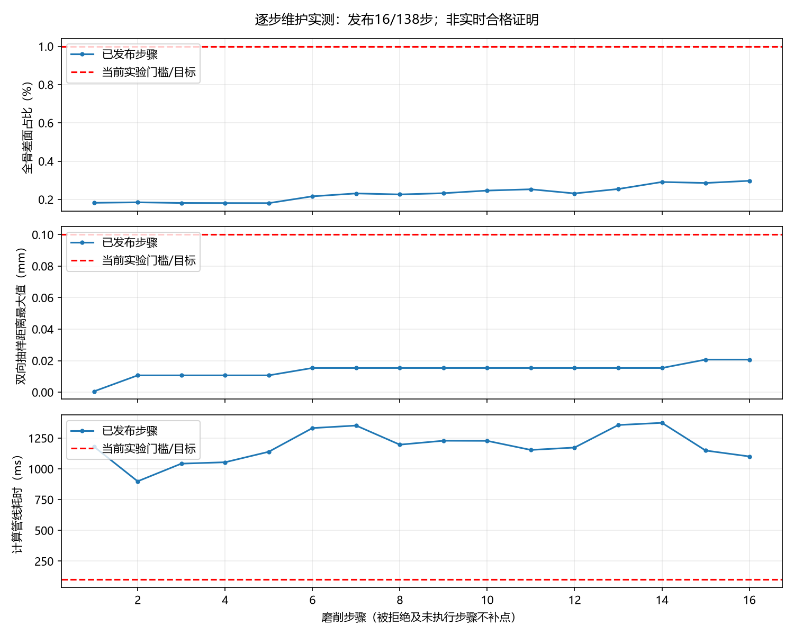
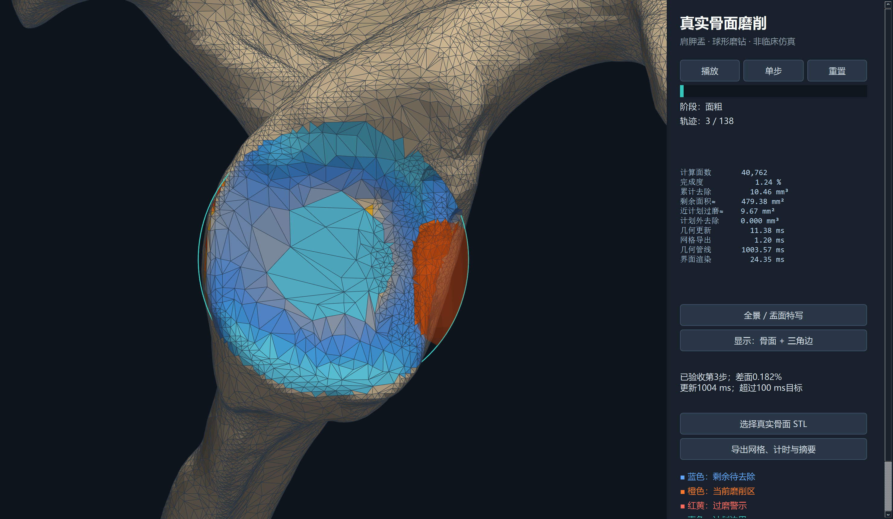

# 11-磨削过程逐步网格质量维护实验与未达标问题报告

> **生成时间**：2026-09-07 16:52:18（北京时间）
> **修改时间及修改内容**：2026-09-07 16:52:18，根据逐步维护、回灌、拒绝回滚和窗口实测首次生成。
> **文档概述**：回应“必须保证磨削过程中每次网格变化的质量，而非磨完后优化”。本次实现逐步维护实验管线，但全序列稳定性、实时性及逐三角形质量保证尚未达成，不作为术中可用或下游分析适用性证明。

## 索引目录

1. 质疑与研究目标
2. 实现及发布契约
3. 实验方法和复现命令
4. 实测结果与失败证据
5. 系统操作和截图
6. 局限与下一步验收

## 一、质疑与研究目标

用户质疑成立：暂停后的优化副本不能替代术中动态建模。当前任务对应工作一的增量更新与工作二的连续显示，不能用渲染帧率代替骨面更新频率。目标是每次切削后维护当前网格，合格网格作为下一次切削输入；质量、几何误差和时限必须同时满足。

本次是非临床真实 CT 肩胛骨仿真实验，继续使用原预置坐标、计划及138步轨迹，数据路径和来源沿用09、10号文档。未开展真实术中试验，未运行有限元或热传导下游求解器。

## 二、实现及发布契约

流程：上一已验收骨面 → 球磨钻扫掠布尔差 → 双精度微边简化 → 局部重网格 → 质量与累计偏差验收 → 提交并回灌。失败则回滚网格、工具位置、轨迹索引与计量记录，并停止继续推进。旧暂停副本入口保留作为对照；新增独立实验入口避免混淆。

- 动态路径使用 Mesh64/to_mesh64，原演示默认单精度不变。双精度输入须为连续、可写数组。
- 简化容差0.001 mm；局部维护半径为工具半径加半段轨迹长度再加1.2 mm；目标边长0.6 mm；3次迭代；投影预算0.005 mm；特征角30°；关闭平滑；最终微简化0.00001 mm。前置简化是全网格操作，不宣称整个计算都已局部化。
- 若检测到自相交，从原候选重试5次迭代、0.001 mm投影预算；仍失败时检查仅简化候选。所有候选使用相同发布门槛，不忽略自相交以换取通过率。
- 当前门槛：水密、绕序一致、欧拉数2、零退化面、PyMeshLab自相交面检测为0；q<0.1的全骨面占比<1%，工具邻域占比<5%；累计双向抽样最大距离≤0.1 mm。
- q=4√3A/(a²+b²+c²)。以上是**占比门槛，不是每个三角形的最小角/形状下界保证**。初始骨面也未经过全局逐面质量达标证明。不能把这组研究门槛解释成下游分析认可的规范。
- 重网格后的状态参与下一次布尔，不是只给渲染器显示的副本。验收期间窗口保留旧画面，并明确提示状态滞后；这并不代表跟上了实时工具位姿。
- 导出NPZ保留验收状态的双精度坐标与索引；PLY只用于可视预览，普通PLY导出的量化结果未单独验收。不得把PLY直接当作通过验收的分析网格。

## 三、实验方法和复现命令

环境：Windows，Intel Core Ultra 5 225H，项目Python 3.13环境；依赖版本见requirements_interactive.txt，无新增Conda或Docker环境。随机种子20260907，双向各取全部顶点加2000个面积均匀样本。参考序列使用相同工具、相同双精度布尔内核，但不回灌重网格，检查累计维护偏差。

该参考不是独立高精度算法，不能验证布尔内核本身的正确性；抽样最大值不是严格Hausdorff上界。全局分位数易受未变骨面大量零距离支配，故保留各步极值、局部差面和拒绝事件。

在项目根目录运行：

```powershell
.\.venv\Scripts\python.exe 初步实验/真实骨模型演示/test_quality_delivery.py
.\.venv\Scripts\python.exe 初步实验/真实骨模型演示/test_dynamic_quality.py
.\.venv\Scripts\python.exe 初步实验/真实骨模型演示/dynamic_quality.py
.\.venv\Scripts\python.exe 初步实验/真实骨模型演示/dynamic_gui_smoke.py
.\.venv\Scripts\python.exe 初步实验/真实骨模型演示/dynamic_quality_report.py
```

原始记录：`初步实验/真实骨模型演示/逐步质量维护实验/results.json`；每轮时间戳run文件用于保留结果。记录包含北京时间、参数、代码摘要、逐步质量、双向距离的均值/P95/P99/最大值及超限样本数、耗时与拒绝原因。当前代码SHA256：`dd6798b41c63a4f1665b5134355b87cead29ec94ebedefe920ac8e7040023ed2`。

## 四、实测结果与失败证据

本轮记录时间：2026-09-07T16:49:16.809182+08:00。

| 指标 | 实测 |
| --- | --- |
| 发布步数/计划步数 | 16/138 |
| 拒绝事件数 | 1（首次失败即停，不是其余步骤均通过） |
| 全骨差面占比范围 | 0.180752%–0.297366% |
| 已发布邻域差面占比最大值 | 2.782324% |
| 已发布步骤中最小q | 5.87554985e-05 |
| 已发布步骤中最小角 | 0.00194361625° |
| 累计双向抽样距离最大值 | 0.020715966 mm |
| 计算耗时均值/P95/P99/最大值 | 1185.26/1361.13/1371.83/1374.51 ms |
| 超过100 ms目标 | 16/16步 |

已发布步骤的退化面和检测自相交面均为0，水密及绕序检查通过；但仍存在极小角，尚不满足“每个三角形均具有形状下界”的强要求。回滚保护了输出，不等于完成了磨削任务。**此次未达到全程实时高质量动态网格目标。**

分项均值如下；metrics_ms来自候选阶段计量，提交后另有再次计量，pipeline_ms还包含参考推进、简化和回灌。因此不能将以下全部行简单相加，pipeline_ms为实测总计。重试维护与check_ms已扣除重叠部分。批量实验不含显示，render_ms=0不能当作实测渲染耗时。

| 字段 | 均值ms |
| --- | --- |
| tool_ms | 4.03 |
| update_ms | 10.46 |
| export_ms | 0.98 |
| metrics_ms | 30.68 |
| maintain_ms | 648.83 |
| check_ms | 428.21 |
| pipeline_ms | 1185.26 |

拒绝候选详细证据（该候选未发布）：

```json
{"step": 17, "quality": {"faces": 42532, "vertices": 21268, "watertight": true, "winding": true, "euler": 2, "volume_mm3": 62190.66484911154, "degenerate": 0, "q_mean": 0.7648420337710152, "q_p05": 0.3845988641122402, "q_median": 0.8204175855505071, "q_min": 1.091534703001463e-07, "bad_q_pct": 0.5243111069312517, "angle_lt5_pct": 0.7077024358130348, "angle_min_deg": 3.6222548091772e-06}, "local_bad_pct": 9.868421052631579, "self_intersections": 2, "forward": {"mean_mm": 6.864912901415973e-05, "p95_mm": 0.0, "p99_mm": 0.002378141581314034, "max_mm": 0.020715965869803996, "over_01mm": 0, "queries": 22934}, "backward": {"mean_mm": 2.0924185834031677e-05, "p95_mm": 0.0, "p99_mm": 0.00047265374622449926, "max_mm": 0.008765707515788862, "over_01mm": 0, "queries": 23268}, "accepted": false, "maintain_ms": 1650.4753999979584, "method": "simplify_fallback", "check_ms": 768.7646000013046}
```

`last_accepted.npz`保存最后已验收状态，`rejected_candidate.npz`保存失败候选以便复现定位。后者禁止作为合格输出。`iteration1_rejected.json`和`iteration3_rejected41.json`保留早期单精度探索失败记录，不与本轮混作受控性能对照。双精度并非万能修复，后续局部重网格仍可能产生检测自相交。



回归测试覆盖解析盒体计量、同面细分距离、等边三角形q值；新增双精度转换、注入失败后原子回滚、重置、连续三步维护回灌。GUI自动测试完成三步并截图；退出时曾出现绑定库引用泄漏警告，尚未进行长时间内存稳定性证明。

## 五、系统操作和截图

```powershell
.\.venv\Scripts\python.exe 初步实验/真实骨模型演示/dynamic_quality_app.py
```

点击“单步”或“播放”，后台每步计算并验收；右侧显示已发布步数、差面比例与超时状态。可以旋转、缩放，切换骨面/三角边/点线视图。失败时停止在上一合格状态，导出按钮保存验收记录和双精度NPZ；需要重置才能再次推进。窗口标题明确标注尚未达到实时目标。



## 六、局限与下一步验收

1. **稳定性优先**：以保存的失败候选定位相交面及边界连接，加入局部拓扑操作前后的几何合法性检查；不能靠不断调参数或允许坏面发布来宣称解决。
2. **明确下游契约**：接触/距离显示、表面偏微分方程、体积有限元对网格要求不同。当前仅验证表面几何指标，尚未有求解器收敛/误差证据；表面三角网格不等于可直接进行体积力学计算的网格。
3. **逐面下界**：增加受影响区的最小角/q下界约束，并明确尖锐计划边界的例外规则；现有百分比指标只用于探索。
4. **实时性**：先拆分所有实际耗时，再实现持久化局部邻接、只更新变化区、缓存未变区域检查；离线全面验证必须保留，但不能简单移走在线检查就声称质量有保证。
5. **完成标准**：真实骨面138步全部通过，同步验证解析几何和独立参考、累计误差及计量漂移，报告多次重复的端到端P95/P99/极值/超时率，之后才能评价是否达到术中模拟的实时质量要求。
