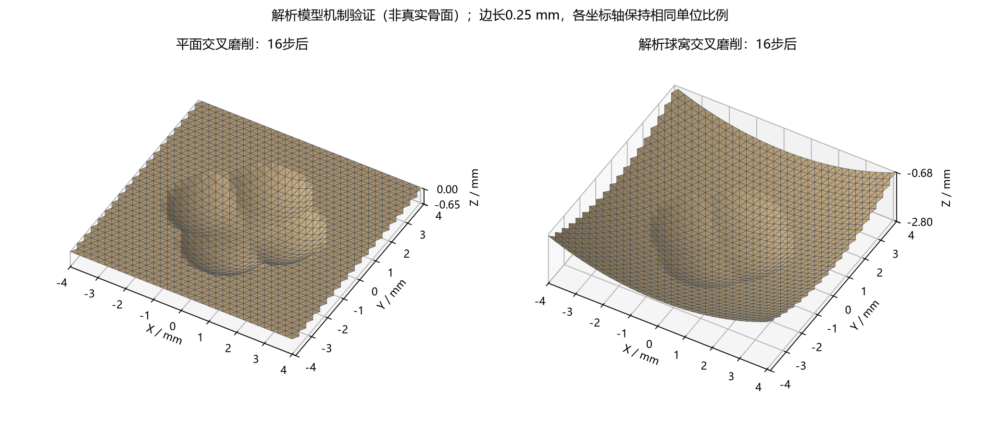
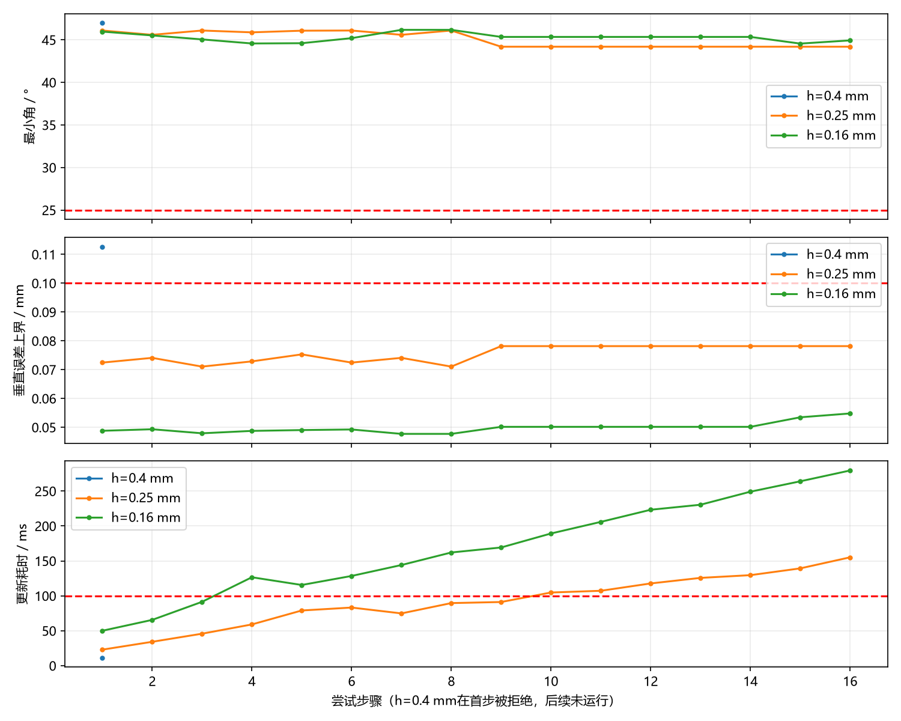

# 12-解析高度图局部重建第一阶段实验报告

> **生成时间**：2026-09-07 17:11:34（北京时间）
> **修改时间及修改内容**：2026-09-07 17:16:18，记录解析高度图原型、27组密度与轨迹实验、64步重复序列、测试及失败边界。
> **文档概述**：回应“不要无止境针对个别失败网格打补丁”，尝试在明确范围内从表示结构避免坏连接。本次是阶段一的机制验证，不是任意三角曲面的局部空腔重三角化，更不是术中可用系统。

## 索引目录

1. 结论与研究定位
2. 几何定义和适用范围
3. 算法与质量契约
4. 垂直误差上界推导
5. 实验设计和结果
6. 复现环境和文件
7. 代码审查、局限与后续门槛

## 一、结论与研究定位

当前采用**固定等边平面底网＋解析高度局部重采样**。维护后的网格没有继承布尔碎片连接，顶点高度直接来自初始解析面及累计工具扫掠。它与11号逐步通用重网格实验是两条隔离路径，原演示入口未改动。

27组实验中，18组属于拟支持的常规场景，17组完整执行；h=0.4 mm交叉轨迹首步因误差证书超限而拒绝。h=0.25和0.16 mm分别完成全部六类常规场景。9组压力/范围外实验均拒绝提交。不能把这些拒绝当作磨削成功。

全部已发布188步的最小角下界为44.189695°，最小q为0.940978；最大的垂直误差上界为0.092052 mm。每组最终状态另用30000个随机查询检查，未发现超过对应逐面证书的误差；最终自相交检测面数均为0。

这是对受限高度图路线的正面证据，**不证明任意骨面每步都能重网格成功，不证明临床精度，也不证明实时达标**。

## 二、几何定义和适用范围

- 单位mm，坐标为局部笛卡尔坐标，非患者坐标系。
- 平面真值：H₀(x,y)=0。
- 球窝真值：H₀(x,y)=7.5−√(100−x²−y²)，半径10 mm。
- 工具为球心等高的水平线段扫掠，半径R、球心高度z_c；球体驻点为零长度线段特例。
- 在球心高于区域最高初始高度C时，工具下表面为z_c−√(R²−d²)，d为XY点到轨迹线段的距离；剩余骨体上表面取初始面与历次工具下表面的最小值。投影圆盘外不更新。
- 无倒扣、无穿透、无新的孔洞或分离碎片；工具不能影响本原型固定外边界。水平运动和单值高度是实质性限制，不是对真实肩胛盂默认成立的假设。
- 底网覆盖约8×8 mm区域，因等边三角排布与取整，各密度的边界有轻微差别；不能将计时差解释为纯粹网格密度因果效应。

## 三、算法与质量契约

1. 初始化等边三角XY底网、共享顶点索引和固定外边界；验证初始高度面也通过门槛。
2. 由扫掠支持域与三角形直径保守筛选受影响面；支持域可能触及边界时拒绝，当前未实现区域扩展。
3. 在候选副本中，仅重采样受影响面的顶点高度，查询解析工具历史，不查询上一帧三角面高度。
4. 计算每个三角形的q与最小角，并更新受影响面的误差证书；区域外证书因真实高度函数未改变而继续有效。
5. 全部满足q≥0.4、最小角≥25°、非退化、垂直误差上界≤0.1 mm时原子提交；否则保留网格及已提交工具历史。

q=4√3A/(a²+b²+c²)。这些阈值是明确的研究试验参数，不是医学或求解器标准。

拓扑依据：XY底网是内部不相交、共享索引的三角剖分，每个顶点只有一个高度。因此不同三角面内部的XY投影不重叠，提升高度不会产生表面自相交；共享边保持连接，法向Z分量保持正值。该论证不适用于倒扣、多值面或任意重新连边。整体为拓扑圆盘、欧拉数1，**局部开放面不要求水密，未构造闭合体网格**。

本次没有动态改变连通关系。真正的非规则曲面区域切除、重新三角化、与真实骨面的缝合，以及网格细化层级之间的无裂缝过渡，均未实现。不同h是独立实验，不是自动在线加密。

## 四、垂直误差上界推导

设三角形内真实高度H的Lipschitz常数上界为L，线性三角面高度为f，其平面梯度为g。每个三角形均匀划分n=32，在全部重心格点采样，共561点；子三角形的最大直径不超过原直径d_T/n。

任意点p存在采样点s满足‖p−s‖≤d_T/n。因此：

**|H(p)−f(p)| ≤ max_s |H(s)−f(s)| + (L+‖g‖) d_T/n。**

工具高度函数可在C处截平而不改变最终骨面。令Δ=z_c−C>0，工具的全局斜率上界为√max(0,R²−Δ²)/Δ。初始平面常数为0；球窝根据区域最大半径给出斜率上界。多个函数取最小值仍可使用其Lipschitz常数最大值。

两张表面具有相同XY定义域，同XY点的三维距离就是垂直差，因此上述界也给出该局部两表面的一个保守距离上界。但这是解析假设下的数学推导与双精度数值计算，未使用区间算术或形式化验证，不应称为任意输入的机器精度严格证明。

这一证书可能保守；证书超限不能直接推断真实最大误差已超限。陡壁时L增大，出现拒绝是可预期行为，不能掩盖为成功。

## 五、实验设计和结果

原始记录时间：2026-09-07T17:06:36.767380+08:00。六类常规场景为浅切、相切、重复切削、交叉轨迹、近边界但不越界、球窝交叉；三类负例为陡壁压力、越界、球心低于区域最高面。每类使用h=0.4、0.25、0.16 mm，轨迹带0.037 mm偏置，避免全部对齐格点。每次更新均验收，第一次拒绝即停。

| h/mm | 场景 | 发布/计划步数 | 已发布最大证书/mm | 最终独立抽样最大/mm | 结果 |
| --- | --- | --- | --- | --- | --- |
| 0.4 | 浅切 | 8/8 | 0.02141 | 0.01629 | 完整执行 |
| 0.4 | 相切 | 8/8 | 0.00000 | 0.00000 | 完整执行 |
| 0.4 | 重复切削 | 12/12 | 0.09205 | 0.06917 | 完整执行 |
| 0.4 | 交叉轨迹 | 0/16 | 0.00000 | 0.00000 | 逐面质量或垂直几何偏差证书超限 |
| 0.4 | 近边界但不越界 | 8/8 | 0.09119 | 0.06815 | 完整执行 |
| 0.4 | 球窝交叉 | 16/16 | 0.09193 | 0.03829 | 完整执行 |
| 0.4 | 陡壁压力 | 0/1 | 0.00000 | 0.00000 | 逐面质量或垂直几何偏差证书超限 |
| 0.4 | 越过固定边界 | 0/1 | 0.00000 | 0.00000 | 扫掠可能触及固定边界：需要扩展区域，本原型拒绝提交 |
| 0.4 | 倒扣范围外 | 0/1 | 0.00000 | 0.00000 | 球心低于区域最高面：不满足无倒扣高度图适用范围 |
| 0.25 | 浅切 | 8/8 | 0.01466 | 0.01067 | 完整执行 |
| 0.25 | 相切 | 8/8 | 0.00000 | 0.00000 | 完整执行 |
| 0.25 | 重复切削 | 12/12 | 0.06015 | 0.04935 | 完整执行 |
| 0.25 | 交叉轨迹 | 16/16 | 0.07816 | 0.06037 | 完整执行 |
| 0.25 | 近边界但不越界 | 8/8 | 0.06082 | 0.04688 | 完整执行 |
| 0.25 | 球窝交叉 | 16/16 | 0.05667 | 0.02540 | 完整执行 |
| 0.25 | 陡壁压力 | 0/1 | 0.00000 | 0.00000 | 逐面质量或垂直几何偏差证书超限 |
| 0.25 | 越过固定边界 | 0/1 | 0.00000 | 0.00000 | 扫掠可能触及固定边界：需要扩展区域，本原型拒绝提交 |
| 0.25 | 倒扣范围外 | 0/1 | 0.00000 | 0.00000 | 球心低于区域最高面：不满足无倒扣高度图适用范围 |
| 0.16 | 浅切 | 8/8 | 0.00985 | 0.00667 | 完整执行 |
| 0.16 | 相切 | 8/8 | 0.00000 | 0.00000 | 完整执行 |
| 0.16 | 重复切削 | 12/12 | 0.03931 | 0.02829 | 完整执行 |
| 0.16 | 交叉轨迹 | 16/16 | 0.05480 | 0.03821 | 完整执行 |
| 0.16 | 近边界但不越界 | 8/8 | 0.03988 | 0.02930 | 完整执行 |
| 0.16 | 球窝交叉 | 16/16 | 0.03594 | 0.01654 | 完整执行 |
| 0.16 | 陡壁压力 | 0/1 | 0.00000 | 0.00000 | 逐面质量或垂直几何偏差证书超限 |
| 0.16 | 越过固定边界 | 0/1 | 0.00000 | 0.00000 | 扫掠可能触及固定边界：需要扩展区域，本原型拒绝提交 |
| 0.16 | 倒扣范围外 | 0/1 | 0.00000 | 0.00000 | 球心低于区域最高面：不满足无倒扣高度图适用范围 |

表中0/计划步数的抽样结果对应未变初始面，不是失败候选的精度。失败候选的角度、q、误差上界和原因保存在attempts中，早期范围检查拒绝则没有这些数值。

独立校验采用另一份端点/直线垂距分段公式，不调用被测高度函数。每组固定种子20260907、30000个三角形均匀选面后面内均匀查询；XY底网等面积，因此为XY面积均匀采样，不是三维表面积均匀。JSON保留误差均值、P95、P99、最大值、超0.1 mm样本数及PyMeshLab最终自相交检测。





### 长序列

h=0.25 mm的16步交叉轨迹重复4轮：发布64/64步，首轮之后相同完整扫掠再次执行，顶点坐标最大变化0 mm。该结果验证重复切削不漂移，不代表64步全部探索新的几何，也不代表一般轨迹长期稳定。

### 时间

27组中排除零受影响面的相切步骤，已接受更新的计算耗时均值/P95/P99/最大值为151.47/548.80/871.79/1001.40 ms；超过100 ms有77/164步。64步长序列的对应值为271.94/465.79/475.66/476.24 ms。

计时包含支持域筛选、候选复制、局部解析重采样、全网格质量计算及局部证书更新；不含初始化、最终独立随机审计、文件输出和渲染。初始化单独记录。工具历史查询成本随历史增长，当前没有缓存压缩；仍有全数组复制与全网格质量扫描。因此不能宣称完整实时系统，也不能与11号真实骨面性能直接对比。

## 六、复现环境和文件

Windows，Intel Core Ultra 5 225H，项目`.venv` Python 3.13；沿用NumPy、Matplotlib、PyMeshLab，无新安装依赖、Conda或Docker环境。

```powershell
.\.venv\Scripts\python.exe 初步实验/局部区域重建阶段一/test_patch.py
.\.venv\Scripts\python.exe 初步实验/局部区域重建阶段一/experiment.py
.\.venv\Scripts\python.exe 初步实验/局部区域重建阶段一/long_sequence.py
.\.venv\Scripts\python.exe 初步实验/局部区域重建阶段一/report.py
```

- patch_model.py：解析工具、规则底网、局部更新、质量与误差证书。
- test_patch.py：六项测试，覆盖解析真值、相切、重复、顺序无关、定向、质量拒绝和边界回滚。
- experiment.py：27组实验；results.json及时间戳run文件保留参数、代码摘要、每步结果。
- long_sequence.py：64步重复交叉，输出long_sequence.json。
- 实验结果/mesh_密度_场景号.npz：双精度坐标、索引、逐面q/角度/证书，失败组保存最后已发布状态。
- report.py：本报告与两张科学绘图的生成脚本。

## 七、代码审查、局限与后续门槛

本次优先验证可证伪行为，未修改第三方代码和真实骨面主线。质量逻辑使用逐面下界，不再以允许坏面占比作为成功标准；解析几何与显示网格分离，失败不提交几何历史。

**当前结论：受限高度图机制值得继续验证，但不能宣布此前提出的通用局部区域重建已完成。**

下一步先验证真实肩胛盂能否在所选区域建立无折叠单值投影，量化拟合误差与坡度；若不满足，拒绝硬套高度图。随后才研究与区域外真实骨面的边界采样/过渡拼接。必须增加不同轨迹相位、半径、方向与步长的系统测试，以及独立空间误差校验。第17步失败案例属于真实曲面问题，尚未由本原型修复。

固定边界扩展、动态密度变化、任意三维扫掠、下游求解器和实时闭环均仍是未完成项；不应为了宣称成功而删除这些范围限制。
