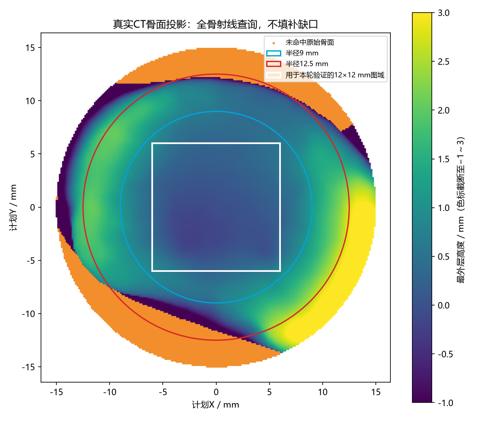
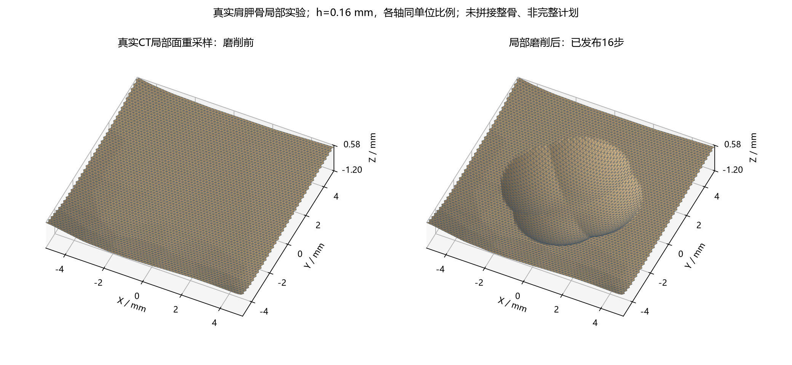

# 16-真实肩胛盂高度图适用域与局部磨削验证报告

> **生成时间**：2026-09-07 17:38:51（北京时间）
> **修改时间及修改内容**：2026-09-07 17:43:17，新增真实骨面投影、图域覆盖/重叠/边界检验、原面叠置误差、局部轨迹与深度压力实验。
> **文档概述**：将12号解析高度图原型推进到真实CT肩胛骨，但先检查单值图域，再进行隔离的局部磨削验证。保留完整计划不适用、边界拒绝和误差超限证据，不把局部验证替代整骨模型或术中可用性。

## 索引目录

1. 本轮结论
2. 数据、坐标与验证方法
3. 投影与图域结果
4. 重建和局部磨削实验
5. 性能、失败与局限
6. 复现与下一步

## 一、本轮结论

真实骨面存在可用于高度图验证的局部图域。本轮保守选用计划坐标中心12×12 mm区域：原三角面投影裁剪后面积为144 mm²，无正面积重叠、无上方遮挡、无内部断开的源网格边界。16×16 mm测试区域也通过同样检查，但本轮几何查询仍限制在12×12 mm内，不外推。

不能直接覆盖原完整计划：半径12.5 mm圆盘内射线出现未命中区，边缘局部坡度大；原凸台/柱钻含深层或垂直轨迹，不满足上一阶段水平等高、单张连续高度图的全部前提。本轮没有运行原138步，也没有修复11号实验的第17步。

本轮运行7组独立局部轨迹配置，5组完整通过，拒绝组如实记录。下面的磨削网格是来自真实STL的开放局部面，不是整骨缝合结果。

## 二、数据、坐标与验证方法

- 原始输入：`初步实验/真实骨模型演示/scapula_hill_sachs_001_R.stl`，40086个三角面，水密=True。
- 来源沿用原演示记录：犹他大学Henninger实验室公开CT重建标本、Zenodo 14590062；本轮未重新下载或外部核验来源，不将已有STL精度当作CT分割精度。
- 文件SHA256：`8e9974dc46b293766bd6d433c54096390ff226082854d66f0dfef37f75460309`；原文件未改写。
- 盂中心GC=[−119.5,−104.9,−94.1] mm，沿用9 mm邻域SVD拟合计划法向。4×4坐标变换完整保存在JSON与NPZ，不重新人为调整以迎合投影结果。
- 射线查询：在计划XY中对原三角形进行重心坐标求交，保留全部高度与最外层面索引；共边/共顶点命中以1e−7 mm高度容差去重。投影行列式绝对值≤1e−12的竖直面不进入点查询；图域覆盖、内部边界与法向检查用于补充其局限。

多次正向穿越可能来自背部骨结构，不能直接据此断言最外层盂面折叠。本轮另外检查选定上表面片的覆盖和源网格连接。

图域选择采用固定高度窗[−2,3] mm及法向Z≥0.5，随后裁剪到指定正方形；检查面积之和、两两正面积交叠、其他原始面是否位于其上方，以及域内部是否存在未成对的源网格边。缺少任一检查，都不足以将抽样覆盖升级为连续图域证据。所有裁剪使用浮点容差，不是精确谓词或形式化证明。

## 三、投影与图域结果

| 半径/mm | 采样间距/mm | 查询数 | 未命中数 | 未命中率 | 多正向层查询数 | 最大采样坡度 |
| --- | --- | --- | --- | --- | --- | --- |
| 4.0 | 0.3 | 561 | 0 | 0.000% | 42 | 0.214 |
| 9.0 | 0.3 | 2827 | 0 | 0.000% | 796 | 0.699 |
| 12.5 | 0.3 | 5453 | 168 | 3.081% | 1361 | 43.115 |
| 15.0 | 0.3 | 7849 | 1306 | 16.639% | 1845 | 74.870 |
| 4.0 | 0.15 | 2238 | 0 | 0.000% | 176 | 0.214 |
| 9.0 | 0.15 | 11309 | 0 | 0.000% | 3168 | 0.699 |
| 12.5 | 0.15 | 21822 | 682 | 3.125% | 5440 | 194.701 |
| 15.0 | 0.15 | 31417 | 5213 | 16.593% | 7391 | 74.870 |

缺口可能对应真实骨轮廓以外，不代表STL损坏或分割错误；说明完整圆盘不能被自动填满为骨面。后续若采用不规则有效域，需要显式处理域边界，不能用插值补成实体。采样只代表这些查询，不证明半径9 mm整个圆盘都成立；下表是更强的分片几何检验。

| 正方形/mm | 源面数 | 裁剪面积/域面积mm² | 重叠对 | 上方遮挡对 | 内部边界边 | 通过 |
| --- | --- | --- | --- | --- | --- | --- |
| 8×8 | 53 | 64.000000/64 | 0 | 0 | 0 | True |
| 12×12 | 137 | 144.000000/144 | 0 | 0 | 0 | True |
| 16×16 | 285 | 256.000000/256 | 0 | 0 | 0 | True |
| 20×20 | 602 | 381.346402/400 | 0 | 0 | 40 | False |



## 四、重建和局部磨削实验

通过图域检查后，使用原三角面分片线性高度函数，没有先平滑或拟合成球窝。重采样初始误差通过XY三角叠置计算：两个线性高度函数在每个交叠多边形上的差仍线性，绝对极值在其顶点取得。该方法不是仅在重建顶点上测误差。

动态阶段复用12号的逐面q≥0.4、最小角≥25°、非退化和垂直误差上界≤0.1 mm门槛。几何依据为原CT面加累计解析工具扫掠，仍不累积上一帧插值误差；保守上界公式和浮点限制见12号报告。原图面斜率上界0.530902，固定图域最高高度0.905799 mm。

新建局部交叉轨迹：X或Y从−1到1 mm、每段0.25 mm，另一轴偏置0.037 mm，共16步，球半径3 mm。默认球心2.95 mm沿用原面精相位高度，但XY轨迹是新的局部试验，不是原计划截取后冒充完整计划。2.5和1.8 mm球心仅为深度压力条件；距离平面0的名义最低高度分别为−0.5、−1.2 mm，实际去除量取决于原骨面。

区域半宽4或5 mm在每次独立运行前指定，仍处于已验证12×12 mm域内。扩大区域是显式实验变量，不是在线自动扩域或与整骨接缝算法。规则底网因行列取整具有小幅边界偏移，准确坐标以NPZ为准。

| h/mm | 球心Z/mm | 名义区域宽/mm | 发布/计划步数（实际变化步） | 最大顶点去除/mm | 已发布最小角/° | 已发布最大误差上界/mm | 最终独立抽样最大/mm |
| --- | --- | --- | --- | --- | --- | --- | --- |
| 0.4 | 2.95 | 8 | 16/16（变化8） | 0.047159 | 57.983 | 0.032999 | 0.020769 |
| 0.25 | 2.95 | 8 | 16/16（变化9） | 0.046257 | 57.778 | 0.019498 | 0.011546 |
| 0.16 | 2.95 | 8 | 16/16（变化9） | 0.047068 | 57.521 | 0.012373 | 0.007314 |
| 0.25 | 2.5 | 8 | 16/16（变化16） | 0.496257 | 51.330 | 0.056566 | 0.033273 |
| 0.25 | 1.8 | 8 | 0/16（变化0） | 0.000000 | 未发布 | 未发布 | 0.011546 |
| 0.25 | 1.8 | 10 | 0/16（变化0） | 0.000000 | 未发布 | 未发布 | 0.011236 |
| 0.16 | 1.8 | 10 | 16/16（变化16） | 1.197155 | 36.754 | 0.073854 | 0.049286 |

零发布组的最终独立误差对应保留的初始面，不能解释为失败候选通过。边界顶点在各组保持不变，但这只证明局部面边界未动，不代表已与整骨共用索引或消除了整骨接缝。

每组最终状态另以10000个固定种子20260907的面内随机点审计：原高度通过全骨射线独立求得，工具通过独立线段投影距离公式求得。所有随机误差均未超过各自面上的证书；JSON保留均值/P95/P99/最大值。最终PyMeshLab自相交检测面数均为0。抽样不替代未执行步骤的验证，不涉及求解器收敛或临床有效性。



## 五、性能、失败与局限

以下时延是单次CPU实验，列出全部尝试（包括拒绝），不是渲染帧率。初始化包括原面叠置误差验证；更新包括候选构建及质量/证书检查，不含最终独立审计、显示、导出。工具历史成本随序列增长，尚未做空间缓存压缩。

| h/Z/区域宽 | 初始化ms | 更新均值ms | P95ms | P99ms | 最大ms | 超100ms/尝试数 |
| --- | --- | --- | --- | --- | --- | --- |
| 0.4/2.95/8 | 274.8 | 82.68 | 127.32 | 131.83 | 132.96 | 6/16 |
| 0.25/2.95/8 | 621.5 | 183.51 | 291.31 | 309.18 | 313.65 | 13/16 |
| 0.16/2.95/8 | 1410.3 | 398.36 | 628.00 | 642.68 | 646.35 | 16/16 |
| 0.25/2.5/8 | 610.0 | 228.00 | 358.91 | 364.44 | 365.83 | 14/16 |
| 0.25/1.8/8 | 615.6 | 0.27 | 0.27 | 0.27 | 0.27 | 0/1 |
| 0.25/1.8/10 | 986.6 | 97.79 | 97.79 | 97.79 | 97.79 | 0/1 |
| 0.16/1.8/10 | 2262.2 | 625.95 | 889.12 | 906.11 | 910.36 | 16/16 |

失败证据：

```json
[
  {
    "spacing_mm": 0.25,
    "center_z_mm": 1.8,
    "half_width_mm": 4.0,
    "attempt": {
      "step": 1,
      "accepted": false,
      "tool": {
        "start": [
          -1.0,
          0.037
        ],
        "end": [
          -0.75,
          0.037
        ],
        "radius": 3.0,
        "z": 1.8
      },
      "reason": "扫掠可能触及固定边界：需要扩展区域，本原型拒绝提交",
      "pipeline_ms": 0.2709000000322703
    }
  },
  {
    "spacing_mm": 0.25,
    "center_z_mm": 1.8,
    "half_width_mm": 5.0,
    "attempt": {
      "step": 1,
      "accepted": false,
      "tool": {
        "start": [
          -1.0,
          0.037
        ],
        "end": [
          -0.75,
          0.037
        ],
        "radius": 3.0,
        "z": 1.8
      },
      "min_q": 0.9025159203882603,
      "min_angle_deg": 41.89071153954815,
      "degenerate": 0,
      "error_bound_mm": 0.10542730882002835,
      "sampled_max_mm": 0.07470847717785219,
      "queries": 660858,
      "affected_faces": 1178,
      "faces": 3760,
      "vertices": 1968,
      "locate_ms": 0.31400000079884194,
      "reconstruct_ms": 0.3371999991941266,
      "lipschitz": 3.2024491065245275,
      "reason": "逐面质量或垂直几何偏差证书超限",
      "pipeline_ms": 97.79450000132783
    }
  }
]
```

这些是统一边界和误差规则的拒绝，不是特殊步号分支。相同深度下扩大区域及增加采样密度是显式对照，原失败记录保留；不能通过删掉边界检查或放宽0.1 mm门槛来声称达标。

还需特别区分：

- 真实几何输入已接入，但输出仍是开放局部面，不是整骨动态布尔替代品。
- 原CT外壳射线相邻交点间距不是皮质骨厚度，也不是安全磨削余量。JSON中的相邻表面距离仅用于仿真几何审计，不能用于手术决策。
- 当前仅一个标本、一个计划坐标系、预设局部轨迹；未做患者泛化、配准误差、任意工具姿态、贯穿及体网格分析。
- 规则网格面数固定，尚未实现自适应重新连边、在线扩域、真实边界拼接和端到端实时系统。
- 原完整计划相位统计：{'面粗': 54, '面精': 54, '台粗': 13, '台精': 13, '柱钻': 4}。深台阶和垂直柱钻不应被隐藏到“局部浅磨削通过”里。

## 六、复现与下一步

沿用项目`.venv` Python 3.13及现有NumPy、Trimesh、Rtree、Matplotlib、PyMeshLab；CPU为Intel Core Ultra 5 225H。无新依赖或Conda/Docker配置。

```powershell
.\.venv\Scripts\python.exe 初步实验/真实骨面高度图验证/test_projection.py
.\.venv\Scripts\python.exe 初步实验/局部区域重建阶段一/test_patch.py
.\.venv\Scripts\python.exe 初步实验/真实骨面高度图验证/experiment.py
.\.venv\Scripts\python.exe 初步实验/真实骨面高度图验证/report.py
```

七项投影/叠置测试覆盖共享边命中去重、背部多层、斜面真值、凸多边形裁剪、叠置误差极值、零面积高度跳变拒绝、禁止越过已验证域外推；阶段一六项回归测试仍通过。代码质量审查补充了图域外推保护和对应回归测试。共享求解器只增加可覆盖的高度查询入口与区域半宽参数，默认解析行为不变。

`实验结果/results.json`及时间戳run文件保存参数、源文件摘要、代码摘要、全部尝试；NPZ保存初始/最终双精度顶点、索引、坐标变换、逐面证书和q。原始数据时间：2026-09-07T17:35:55.978138+08:00。

下一步优先设计原始骨面与局部重建面的共边拼接及过渡区域验收，再评估如何处理原计划的不规则骨轮廓和深度台阶。即使局部图域可用，也不能跳过这些步骤直接宣布整骨动态质量问题已解决。
