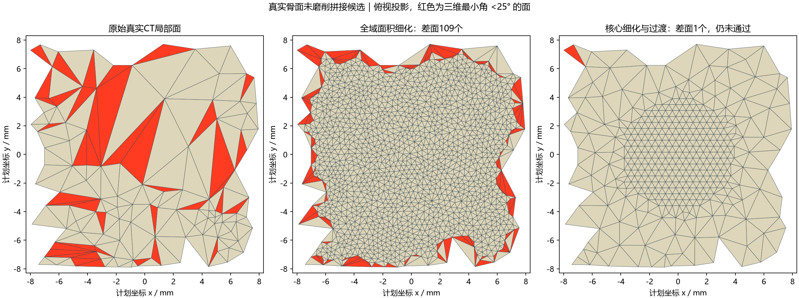

# 17-真实骨面共边拼接与过渡带质量实验报告

> **生成时间**：2026-09-07 18:04:05（北京时间）
> **修改时间及修改内容**：2026-09-07 18:04:05，首次生成，记录固定边界共边替换的12组实验及未达标原因。
> **文档概述**：承接16号开放局部面实验，验证真实骨面共边拼接，不执行不合格状态上的磨削。本报告属于研究内容一的边界相容性与联合质量约束验证，不是实时系统或下游求解器验收报告。

## 索引目录

- 一、结论与本次质疑的回应
- 二、方法与验收
- 三、完整实验结果
- 四、原因分析与下一阶段
- 五、复现、测试与环境
- 六、边界与来源

## 一、结论与本次质疑的回应

本次实现了真实骨面的共享顶点索引拼接：12组候选全部水密、绕序一致、无边界边、无非流形边，引用顶点计算的欧拉示性数均为2；但是**12组均未同时通过逐面质量和几何门槛，完整交付通过数为0**。

用户要求的是磨削过程中每个发布状态合格，而非末帧优化。因此初始拼接未通过，不能启动磨削序列，也没有接入桌面演示。既不能把“拒绝了坏网格”写成“成功完成磨削”，也不能把水密写成下游分析可用。

较有希望的8 mm半宽、核心面积参数0.1组，仅剩1个差面，但最小角23.392°低于25°，最大垂直偏差0.11859 mm高于0.1 mm，仍然拒绝。该组检测器无自交报警。这是后续改进的对照点，不是合格产品。

## 二、方法与验收

输入沿用16号的公开真实CT肩胛骨、相同计划坐标变换和原始三角面高度查询。原网格有20045个顶点、40086个面。输入原文件不修改；完整骨面候选及局部候选保存在独立NPZ。

1. 对半宽6/8 mm的方形执行原有图域验证。只删除完全位于方形内部且属于已验证表层的原始三角面，实际边界是原始不规则边链，并非方形裁剪边。
2. 检查局部拓扑盘及单一闭合边环；边界顶点坐标、线段及全局索引固定。
3. 使用Triangle约束二维三角化，所有新顶点高度取自原始分片线性CT面；保留外部原面及原顶点数组，新顶点追加。不是把独立表面叠在一起。
4. 比较两种生成策略：全域面积细化 `pq30Ya...QS200000`；核心半径4 mm内规则铺点、取消外部面积约束的自然渐变 `pq30YQS200000`。渐变组间距为 sqrt(4A/sqrt(3))，域外核心点过滤。面积参数A=0.1/0.04/0.0125 mm²；每次最多增加200000个Steiner点。
5. 每个候选检查三维逐面q≥0.4、最小角≥25°、无退化、共边拓扑、检测器无自交报警、原面叠置覆盖误差≤1e-7 mm²以及最大垂直几何偏差≤0.1 mm。未修改全骨原面的既有质量另外记录，不套用重建区域门槛。

`q30`是二维生成请求，不等于三维25°验收证明；`Y`禁止边界分裂，可能限制质量与面积请求的实现，输出最大面积也已记录，不能把输入A宣称为所有输出面的面积上界。

几何比较将输出三角面与原始三角面投影裁剪叠置，在交叠多边形顶点求分片线性高度差极值，非随机抽样最大值；仍受浮点裁剪容差影响，不是精确谓词的形式化证明。JSON给出逐面最大误差的均值/P95/P99/最大值；这些分位数是**按面等权**，不是面积均匀点采样，也不是Hausdorff距离。

## 三、完整实验结果

实验时间：2026-09-07 18:03:43（北京时间）。列“报警”指PyMeshLab自交检测选中面数，不等同于经过独立精确复核的真实穿插数。原始输入报警数为0。

|半宽mm|方法|A mm²|新面数|最小角°|最小q|差面数|偏差上界mm|报警|构建验收ms|结论|
|---|---|---|---|---|---|---|---|---|---|---|
|6|全域细化|0.1|768|3.876|0.1092|88|0.07414|4|430|拒绝|
|6|全域细化|0.04|1922|3.557|0.0995|151|0.05970|17|584|拒绝|
|6|全域细化|0.0125|6214|1.080|0.0325|296|0.06179|95|1774|拒绝|
|6|核心渐变|0.1|504|0.446|0.0127|35|0.06460|0|442|拒绝|
|6|核心渐变|0.04|1254|0.019|0.0006|67|0.06460|13|621|拒绝|
|6|核心渐变|0.0125|3638|0.062|0.0017|92|0.06460|17|1137|拒绝|
|8|全域细化|0.1|2966|8.206|0.1862|109|0.03122|6|1614|拒绝|
|8|全域细化|0.04|7244|4.965|0.1440|207|0.02302|35|2325|拒绝|
|8|全域细化|0.0125|23178|3.239|0.0969|449|0.02018|135|6376|拒绝|
|8|核心渐变|0.1|708|23.392|0.5991|1|0.11859|0|547|拒绝|
|8|核心渐变|0.04|1658|20.938|0.5672|2|0.11852|0|811|拒绝|
|8|核心渐变|0.0125|4772|23.392|0.5911|2|0.21740|6|1553|拒绝|



图中左右使用相同真实骨面区域与比例，红色仅标记角度不合格面；正式差面统计同时考虑q。中图109个、右图1个差面，二者都不合格。以上均为**未磨削**候选，不是术中磨削成果图。

## 四、原因分析与下一阶段

实验证据：全域加密不能自动解决固定粗边界的过渡问题；核心自然渐变明显减少差面，但过渡区变粗又可能超出几何误差预算，核心越密也不保证全域最大误差越小。单纯更换面积参数不能作为已验证解决方案。

本次未证明“固定边界数学上必然无解”，也未证明所有其他三角化算法都会失败。结论仅限本数据、两种生成策略及当前参数矩阵。

下一阶段应把**边界和过渡带作为一个受约束重建域**：依据工具影响域及几何误差确定核心；按边长尺度和几何偏差扩展维护带；允许边界分裂时，把相邻原面同时纳入并共享新索引，禁止T形接缝；在新外边界上同时检查几何与质量条件。不能只细分边界而不处理邻面，否则差面会被转移到外侧。

验证顺序固定为：初始整骨联合验收 → 16步局部磨削每步验收 → 扩展轨迹与重复序列。任何一步失败保留候选与原因，不能放宽25°或0.1 mm门槛冒充完成。是否需要更一般的边界重构，应由这些实验决定，而不是专门修改某一个失败三角形。

## 五、复现、测试与环境

沿用项目`.venv`，Python 3.13.14，CPU Intel Core Ultra 5 225H（14核/14逻辑处理器），Windows-11-10.0.26200-SP0。本次新增triangle==20250106，没有创建Conda或Docker环境。继承上一阶段numpy、trimesh、rtree、matplotlib、PyMeshLab依赖。

```powershell
uv pip install --python .\.venv\Scripts\python.exe -r .\初步实验\真实骨面共边拼接\requirements.txt
.\.venv\Scripts\python.exe .\初步实验\真实骨面共边拼接\test_stitch.py
.\.venv\Scripts\python.exe .\初步实验\真实骨面高度图验证\test_projection.py
.\.venv\Scripts\python.exe .\初步实验\局部区域重建阶段一\test_patch.py
.\.venv\Scripts\python.exe .\初步实验\真实骨面共边拼接\experiment.py
.\.venv\Scripts\python.exe .\初步实验\真实骨面共边拼接\report.py
```

实际测试：共边拼接4项、图域7项、解析更新6项，合计17项通过。新增测试覆盖共边索引与外部原面不变、窄长但水密候选被质量门槛拒绝、多分量与非流形拒绝。正常方形顶面得到合格候选，说明门控不是无条件拒绝。

耗时为各候选一次构建与验收，包含重三角化、原面查询、质量/叠置/自交检查，不包含图域前处理、磁盘保存或渲染；无重复计时置信区间，不是几何更新帧率或端到端延迟。`results.json`记录参数、输入几何摘要、代码摘要和各组指标；12个带g0/g1后缀的NPZ对应正式矩阵。无g后缀的6个NPZ是首轮探索保留证据，不参与最终统计。

自审使用karpathy-guidelines与code-review-and-quality：新增功能隔离在独立实验目录；自交检查与其他门槛集中于同一验收入口，避免调用方误用中间通过标志；修正域外铺点并增加合格/不合格反例。不修改原演示或原始骨面。

## 六、边界与来源

未解决原138步完整计划、倒扣、垂直柱钻、逐步自适应边界、实时延迟或下游有限元/接触分析验证。全骨未修改区域仍有既有小角面，不能声称整骨每个三角形均满足门槛。

Triangle为外部成熟组件，不是本课题自研算法。官方资料核验于2026-09-07：[API](https://rufat.be/triangle/API.html)、[固定边界示例](https://rufat.be/triangle/data.html)、[质量约束说明](https://rufat.be/triangle/quality.html)。其底层Triangle有商业使用限制，不能直接当作无条件可商用依赖，见[作者主页及许可证说明](https://www.cs.cmu.edu/~quake/triangle.html)。这里只用于非临床学术实验。网格实际结果以本地运行证据为准，不以库的宣传能力替代验收。
