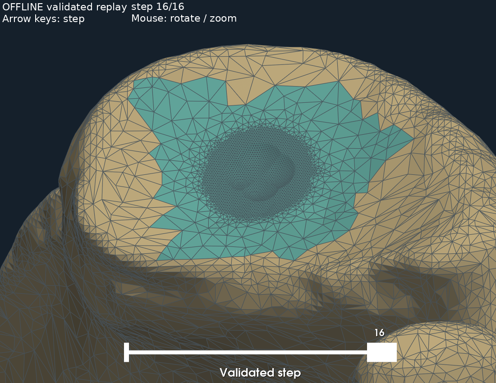

# 19-边界过渡带联合重建与整骨逐步验收报告

> **生成时间**：2026-09-07 18:43:12（北京时间）
> **修改时间及修改内容**：2026-09-07 18:43:12，首次生成；记录联合重建、已有方法基线与消融、两条整骨磨削序列、深切拒绝及核显核验。
> **文档概述**：优先收尾17号遗留的边界与过渡带问题，承接18号学术验证规范。当前取得受限场景整骨拼接与逐步验收闭环，不代表原138步、一般动态重三角化或实时GPU系统完成。

## 索引目录

- 一、结论与收尾范围
- 二、数学依据与算法边界
- 三、已有方法基线与消融
- 四、动态整骨序列与独立复核
- 五、性能与核显核验
- 六、代码、回放与复现
- 七、局限与后续任务

## 一、结论与收尾范围

本次完成“原始骨面—联合维护域重建—共边整骨拼接—每步验收—整骨序列回放”的受限闭环。新方法不按失败面编号修补，而是统一依据差面与几何偏差决定维护域扩展、内部采样。

初始维护域由178个原始面扩展到215个，新增剖分4823个面；初始最小角25.926°、最小q约0.5977、最大垂直偏差0.09471 mm。浅磨与中等深度各完成16步，分别9/16步和16/16步确实改变顶点高度；不能将浅磨的7个无变化步骤计为有效切削事件。

这是单个真实CT模型上的两个局部交叉轨迹，不是原138步完整计划。深切球心z=1.8 mm低于扩展图域最高高度约2.26184 mm，当前保守适用性判据拒绝它；该判据拒绝不等于物理上一定出现倒扣。没有把该失败列为通过，也没有宣称所有网格均能保证质量。

## 二、数学依据与算法边界

### 2.1 维护域与候选生成

设原面待替换三角盘为P，其相邻原面集合为N(P)。若候选差三角形涉及P的原边界顶点，将相关原顶点邻接面纳入维护域：`P_next = P ∪ N_bad(P)`。新外边界继续与未修改原骨面共享顶点索引；原边界部分变成维护域内部，可以重新连接，而不是在原接缝旁叠加独立网格。

每次扩展均重新检查三角盘、边界单环、原面投影无重叠及无遮挡，限制原面高度窗[-2,3] mm、法向z≥0.5。不是将未验证域直接外推。对叠置几何偏差>0.08 mm的候选面统一加入重心采样点，0.08是生成裕量目标，验收门槛仍为0.1 mm；核心半径4 mm铺点，面积参数0.0125 mm²，沿用约束Delaunay质量生成。最多16轮，失败不发布。

该过程是有限预算的反馈重建策略，**尚无一般收敛证明或必然生成合格网格的证明**。维护域可行性、投影和质量检查决定每个候选能否接受。仅保留外围原边界，不要求保持旧维护域边界的所有连线。动态磨削阶段目前固定新底网、更新高度并逐步验收，尚非工具移动时持续扩展空腔的通用算法。

### 2.2 几何误差证书

在单值图域中记目标高度为f，输出三角面线性高度为g；若f为L-Lipschitz，g的梯度范数为G，每点距某验证格点≤δ，则由三角不等式：

`|f(x)-g(x)| ≤ max_s |f(s)-g(s)| + (L+G)δ`。

对重心格点细分，采用保守覆盖半径 `δ=diam(T)/n`。原CT分片线性面的L取参与图域原面梯度范数上界；水平等高球心扫掠下包络的L需要球心高于图域最高面这一条件。最小值组合可沿用各分量的最大L，但不能推广到无界坡度、倒扣或未验证投影。

粗过渡面用n=32得到的余项可能过于保守，因此对证书超限面按32、64、128、256、512逐级加密**验证格点**，不移动网格、不改变磨削状态；最高预算仍不通过则拒绝。探索中n上限256时，中等深度第9步上界0.10923 mm、采样最大误差约0.02594 mm，该失败记录保存在探索JSON；提高验证分辨率后才通过，不把原记录追改为成功。

图域边界查询允许1e-10 mm数值容差：仅将如此接近的域外查询投影到最近边界并线性查询边界高度，越过容差拒绝；证书另计原面L乘该容差。这里的数学界仍依赖L与覆盖前提，实现采用浮点算术，不是全流程区间算术证明。

### 2.3 自交报警的严格复核

初始联合候选仍有PyMeshLab的2个报警面；它们无共享顶点。对报警面两两取XY投影，沿每条边法线计算投影区间。如果任一轴上的区间严格分离，则两个投影不相交，三维三角形也不可能相交。

复核使用输入浮点数的精确有理表示（Fraction），不是扩大浮点容差删除报警。所有报警面两两严格分离才排除这批报警；接触、重叠、孤立单面报警或无法判定均仍拒绝。原始报警计数、NPZ布尔标记与未排除面对应关系保留。

这是报警集合的充分分离复核，依赖检测器返回完整报警面集合，不是独立覆盖全骨所有三角形对的自交证明。所有基线和消融采用相同复核口径；17号旧报告保留原检测器结果，不回写。

## 三、已有方法基线与消融

算法来源核验于2026-09-07：Shewchuk，1996，*Triangle: Engineering a 2D Quality Mesh Generator and Delaunay Triangulator*，作者提供的[论文HTML全文](https://www.cs.cmu.edu/~quake/tripaper/triangle0.html)，其中[细化算法部分](https://www.cs.cmu.edu/~quake/tripaper/triangle3.html)说明约束恢复与质量细化机制；[负结果部分](https://www.cs.cmu.edu/~quake/tripaper/triangle5.html)说明不能对任意输入边界无条件保证质量。本次不把论文中受假设约束的理论保证直接用于三维骨面。

实现采用triangle Python包装20250106，底层Triangle；固定边界基线使用 `pq30YQS200000`，即在本任务的固定共边限制下运行成熟约束Delaunay生成方法，再提升到原CT面。它不是论文全部算法的逐项复现，也不是无约束Triangle的最佳表现。GPU与其他布尔/重网格正式基线尚未完成；本次只验证联合机制，不能由这四组推出优于所有已有方法。

四组使用同一输入、初始区域、核心间距、二维角度请求和验收门槛，仅切换域扩展与误差细化。无单独为基线降低质量或加速预算；实际迭代次数与累计耗时单列。维护范围本身是实验变量，最小角统计覆盖各自全部新面，并非面积完全相同的误差平均对照。

|方法|替换原面数|最小角°|垂直偏差mm|差面数|生成轮数|构建及验收ms|结果|
|---|---|---|---|---|---|---|---|
|固定边界基线|178|23.392|0.21740|2|1|1730|拒绝|
|只细化内部|178|23.392|0.07308|3|2|4353|拒绝|
|只扩展维护域|198|29.015|0.14812|0|3|6734|拒绝|
|联合方法|215|25.926|0.09471|0|5|11571|通过|

本配置中，内部细化解决偏差但不能独自解决边界小角；域扩展改善形状但不能独自保证偏差；联合方法通过。该结果支持机制假设的局部可行性，仍需更多模型、轨迹及参数检验，而非一般必要性证明。

## 四、动态整骨序列与独立复核

全部使用同一个合格初始整骨候选，水平交叉轨迹16段、球半径3 mm。每步包含几何质量与证书检查、整骨拓扑和自交复核；外边界未改变。整骨复核失败会回滚顶点、工具历史、误差界和质量缓存，并同步审计状态。

|球心z/mm|接受步数|实际变化步数|最大去除mm|最小角°|最大证书mm|均值ms|P95 ms|P99 ms|最大ms|
|---|---|---|---|---|---|---|---|---|---|
|2.95|16/16|9|0.04784|25.926|0.09956|873.7|1212.6|1264.1|1276.9|
|2.5|16/16|16|0.49784|25.926|0.09911|978.6|1470.6|1878.6|1980.6|
|1.8|0/16|0|0.00000|—|—|0.0|0.0|0.0|0.0|

每条成功序列保存17个状态（含初始），逐状态重读确认全部新面q≥0.4、角≥25°、无退化、XY不变、未修改原面所引用顶点逐项不变。覆盖误差因XY连接不变沿用初始叠置检查，不伪装成每步重新测量。

末态各按三维面面积加权采样10000点，种子20260907。从原始整骨独立射线查询原高度，再直接计算工具扫掠下包络，不调用重建图域的高度定位器。结果为：

|z/mm|平均误差mm|P95 mm|P99 mm|采样最大mm|
|---|---|---|---|---|
|2.95|0.006797|0.030748|0.047722|0.087019|
|2.5|0.006955|0.031175|0.047818|0.087019|

全部采样误差位于对应末态证书内。该交叉检查独立于图域定位实现，但仍共享水平扫掠模型，不是独立精确三维布尔参照；正式比较仍需补充。三角质量门槛仅适用于重建及过渡区域，未修改全骨的既有差面不因此消失。

## 五、性能与核显核验

CPU为Intel Core Ultra 5 225H，Python 3.13.14，系统Windows-11-10.0.26200-SP0。正式矩阵是一次运行，不提供重复计时置信区间；上表是序列内逐步统计，包含拒绝请求，不能解释为多次独立实验的分布。

中等深度显式计时均值：单步含整骨检查978.6 ms、局部更新管线712.7 ms、证书计算710.0 ms、高度查询619.6 ms。高度查询多数发生在证书计算内，属于嵌套时间，禁止将四项相加。以上不含初始化、文件保存、状态风险字段与渲染，**未达100 ms目标，也不是完整系统端到端延迟**。

探索性cProfile记录中出现累计时间小于自身时间等不一致，未据此形成性能结论；保留cpu_profile文件供追查，正式结论使用显式perf_counter计时。profile_run.py可对已保存合格初始网格单独复测。

本机只读核验：GPU设备名 `Intel(R) Arc(TM) 130T GPU (16GB)`，驱动 `32.0.101.6554`，OpenCL版本 `OpenCL 3.0 NEO`，驱动声明cl_khr_fp64支持。设备名中的16GB不能解释为独立显存容量；WMI AdapterRAM也不用于推断可用显存。本次未安装GPU驱动、CUDA、PyOpenCL或新Conda/Docker环境，未编译或运行GPU算子。

因此核显不是“完全不能开始GPU研究”的证据；可以后续实测OpenCL计算与双精度正确性，但目前只有后端枚举结果，没有硬件原生FP64吞吐或加速结论。CPU计时提示优先评估批量扫掠高度查询与证书计算，同时考虑整骨检查的串行开销，不宣称GPU必然达到实时要求。设备查询接口参见[PyOpenCL设备文档](https://documen.tician.de/pyopencl/runtime_platform.html)（官方接口资料，不是性能证据）。

## 六、代码、回放与复现

新增实验位于`初步实验/边界过渡带联合重建/`，沿用现有环境和依赖。唯一旧实现变动为stitch_candidate增加可选内部点参数，默认固定边界对照行为不变；原始STL、旧结果及原桌面入口均未覆盖。

```powershell
.\.venv\Scripts\python.exe .\初步实验\边界过渡带联合重建\test_joint.py
.\.venv\Scripts\python.exe .\初步实验\边界过渡带联合重建\hardware_probe.py
.\.venv\Scripts\python.exe .\初步实验\边界过渡带联合重建\experiment.py
.\.venv\Scripts\python.exe .\初步实验\边界过渡带联合重建\audit_saved.py
.\.venv\Scripts\python.exe .\初步实验\边界过渡带联合重建\profile_run.py
.\.venv\Scripts\python.exe .\初步实验\边界过渡带联合重建\replay.py
```

回放默认加载z=2.5的合格序列：拖动滑块或左右方向键切换步骤，鼠标旋转缩放。它展示同一完整骨面上的已验收状态，不进行在线几何运算；原交互系统的在线算法尚未替换。加`--screenshot`生成下面的真实整骨截图，不进行视觉造假或AI生成。



新测试6项、原解析6项、图域7项、共边4项均通过，共23项；另有34个保存状态及两组末态采样复核。代码以karpathy-guidelines控制改动范围，并按code-review-and-quality复核验收和状态一致性。探测脚本无新增依赖，GPU计算后端尚未配置。

## 七、局限与后续任务

本轮收尾的是“合格初始拼接＋受限浅/中深度序列＋整骨回放与证据”，不是全部研究问题。新策略无通用收敛保证；原138步、深切适用性、随工具动态扩展维护域、更多真实模型、完整文献基线、GPU算子与在线系统均未完成。

后续优先在不放宽质量约束的前提下研究局部而非全域最高高度的适用性/误差界，并在独立测试输入上验证，避免为z=1.8单独改参数；同时基于已有OpenCL设备核验尝试GPU计算。不能将本轮受限成功包装成术中全流程实时系统或临床安全性证明。
