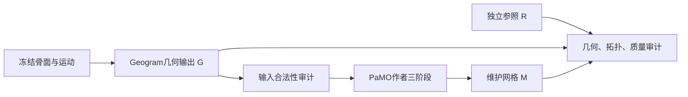

# 34-Geogram与PaMO组合优化研究方案及Agent执行指南

> **生成时间**：2026-09-22 15:10:31（北京时间）
> **修改时间及修改内容**：2026-09-22 15:10:31，首次生成：依据用户确认的“基于Geogram与PaMO结合开展优化”路线、33号实验和固定版本源码，明确方法继承关系、组合基线、数据契约、实验关口和Agent交接任务。
> **文档概述**：本文件供后续Agent直接参考执行。当前交付的是方案，不是组合算法已实现或PaMO已复现的报告。执行起点为T0→T1→T2；缺少CUDA连接时先完成本地可做部分。已有代码与实验证据保留，具体创新机制在组合复现后选择。

## 索引目录

- [一、执行摘要与当前决定](#一执行摘要与当前决定)
- [二、已有基础与证据边界](#二已有基础与证据边界)
- [三、方法继承与组合架构](#三方法继承与组合架构)
- [四、数据契约与发布规则](#四数据契约与发布规则)
- [五、复现前必须补齐的事项](#五复现前必须补齐的事项)
- [六、分阶段任务与进入条件](#六分阶段任务与进入条件)
- [七、候选改进机制与选择规则](#七候选改进机制与选择规则)
- [八、统一评价与实验设计](#八统一评价与实验设计)
- [九、执行命令与结果组织](#九执行命令与结果组织)
- [十、Agent分工与交接模板](#十agent分工与交接模板)
- [十一、完成定义与资料索引](#十一完成定义与资料索引)

## 一、执行摘要与当前决定

**研究起点：继承Geogram的精确CSG及PaMO的网格优化方法，先建立二者组合的可复现基线，再针对连续骨磨削中实测存在的局限改进关键机制。**

后续工作必须能够写成：

> 基于Geogram与PaMO组合，在连续磨削的某类输入上观察到问题Y；在保持指定几何与质量要求的前提下，通过机制Z改善指标W，并用原组合对照和消融验证。

目前Y、Z、W尚未全部确定，不能先写成既成创新。

本方案是该路线的当前执行入口；具体任务顺序优先于18号、32号中旧的“继续来源约束/多支曲面生成”待办。三项研究仍按算法、系统、状态表达分工，18号的科学验证规范继续有效。最新用户决定优先。

| 决策项 | 本版执行决定 |
| --- | --- |
| 研究一主攻 | 组合方法的几何保真、质量维护和连续稳定性 |
| 第一套组合 | 同一Geogram闭合输出→PaMO作者完整三阶段→独立审计 |
| 自研改动开始时间 | 原组合复现和失效归因完成以后 |
| Geogram角色 | 首先作为组合中的几何模块和受审计的强参照；是否保留在线由实验决定 |
| PaMO角色 | 优先继承的质量优化方法；是否适配本任务仍待实际运行 |
| 旧高度图／来源约束v3 | 冻结为受限对照、反例与评价工具，暂停外围扩展 |
| CUDA | 仍为必做；PaMO原版需要NVIDIA设备，Mac完成准备和CPU审计 |
| 本轮不扩展的方向 | 新GUI、神经网络、机器人控制、临床试验、通用几何引擎 |

**组合本身是项目适配基线，不冒充任何一篇论文的原方法；库调用、去重、环境适配和测试数量均不能单独作为算法贡献。**

## 二、已有基础与证据边界

本次方案核查时，项目HEAD为`1d53005`，前一实现提交为`0830f45`。两个作者仓库及Warp子模块实际版本如下：

| 对象 | 固定版本 | 已有状态 |
| --- | --- | --- |
| Geogram | `130442ff0f0c069d48ab4ebb4012218f3d861cf2` | 本机已构建，33号完成有限解析场景审计 |
| PaMO | `a10e34351eb7de71f41eb279e7ab9b2b101cf7a4` | 作者源码及四例远端包存在，尚无本任务运行结果 |
| PaMO Warp | `fd17b8594a2f95f500884ff3d87904d776750897` | 已拉取；不能因此推断所有运行依赖均已锁定 |
| 回归测试 | 33号记录17组89项通过 | 历史实测；本次仅编写方案，未重新运行算法测试 |
| 远程连接 | 根目录`.env`当前不存在 | 不能推断旧租用实例仍在运行，也不能记为算法失败 |

### 2.1 对33号结论的使用范围

33号9个配置来自一个解析倾斜交叉案例及其变体，不是9个独立骨标本。正常去重分支通过了该脚本的完整实体基础拓扑检查及`0.1 mm`抽样几何门槛，未通过三角形质量交付。s3上表面2070面中874面不合格，s4为3827面中1299面不合格。

以下限定必须随结论保留：

- **Geogram输出是几何参照，不是无条件真值。** 精确谓词不能消除工具三角离散、坐标输出和不满足输入前提产生的问题。
- 33号`accepted_as_geometry_baseline`没有把完整实体自交排除作为充分条件；上表面仍有检测器报警。因此它只表示通过所列有限检查，后续需补输入合法性审计。
- s3的`0.003170 mm`是该`0.7 mm`工具的径向缺额，不是全部骨面误差。33号s3综合抽样最大值为`0.013648 mm`；更早四例的`0.0032–0.0073 mm`也不能改称完整双向误差证书。
- 厚片的`0.1 mm`参数是XY网格间距，不是实体厚度；底面为`z=-0.9 mm`，顶面由案例平面系数决定。
- 重复工具5次中1次内核终止、4次非水密，是当前适配链的观察。输入自身合法性、FP64回灌和退化束的具体因果尚未完全分离。
- 删除完全重复工具是当前链的防护选择，不能由此推出“解析去重后所有连续输入必然可靠”。
- Python驱动曾发生一次段错误，开启`PYTHONFAULTHANDLER`后完成运行只增加诊断能力，不算修复证明。

33号已经完成的配置不反复重跑以制造工作量；T0只核对证据与输入，新增实验须解决明确问题。真实CT 16步和原138段的历史负例继续保留，未因33号而全部解决。

### 2.2 现有四例包与迁移

旧包：`初步实验/共同运动记录与方法对照/实验结果/20260918_000143_pamo_prepared/pamo_remote_bundle.tar.gz`。

核验SHA256：

`c4c72ae66010cffe0979e81c72a93980adccf6809dd1615ad477692569c61367`

它包含旧四例`challenge_v2_raw_failure_a011/a015/a019/a023`的完整Geogram闭合OBJ，不包含33号全部新配置。输入哈希以同目录`manifest.json`为准。

部分OBJ、VTP和压缩包只在本机，未被Git跟踪。其他Agent或新检出必须核查文件是否实际存在；只有结果JSON不等于拥有可运行输入。无法取得原文件时按冻结代码重生成，保存新目录和新摘要，不能把新输出宣称为旧字节快照。

## 三、方法继承与组合架构

### 3.1 数学目标

以骨坐标系、毫米为单位，初始骨实体为\(B_0\)，第\(i\)段有效切削运动扫掠为\(S_i\)：

\[
B_k=\operatorname{reg}\left(B_0\setminus\bigcup_{i\leq k}S_i\right).
\]

其中`reg`表示按实体材料边界理解正则化集合结果，避免把相切后残留零集直接当成材料面。球心分段线性运动和恒定半径下，\(S_i\)为胶囊；运动采样间隔内的线性插值是假设，停钻或缺失连接处不自行补线。

术前计划用于状态比较。除非输入明确说明存在物理切削约束，实际运动不被计划圆柱裁掉；旧138段的“裁剪工具计划”单独作为历史任务，不混作无约束实际运动。

符号约定：

- \(G_k\)：Geogram对离散工具得到的几何输出，仍含误差及有效性状态。
- \(M_k=P_{\theta}(G_k)\)：PaMO参数\(\theta\)下的维护输出。
- \(R_k\)：评价用的独立几何参照。解析场景优先使用完整解析边界；真实CT场景使用经独立验证的离线结果，并说明其误差。

### 3.2 第一套可归因组合

第一阶段先做“固定输入的质量维护”，避免混入连续回灌因素：



| 模块 | 继承内容 | 项目适配／拟研究边界 |
| --- | --- | --- |
| Geogram | 原布尔API、精确求交与边界构造 | 轨迹转工具、I/O、输入检查；冻结其默认语义 |
| PaMO阶段一 | SDF与DMC重网格 | 先原样复现，记录归一化与实际分辨率 |
| PaMO阶段二 | CUDA简化与避免相交的机制 | 先沿用原规则，记录实际面数与停止条件 |
| PaMO阶段三 | 对输入表面的安全投影 | 先核对原目标、碰撞约束和默认参数；改目标须重新验证 |
| 评价与发布 | 复用现有质量、状态、Qt工具 | 统一版本与单位，独立计量，不改算法结果来美化输出 |

当前源码入口是`reference/近期强基线_20260908/pamo/simp_cuda/pamo/__init__.py`的`PaMO`，不是仓库根目录下的`pamo.py`。

源码已核对的注意事项：

1. `example.py`将顶点转为FP32并送CUDA。FP64 Geogram与FP32 PaMO的组合可评价，但不能称同精度实现。
2. `target_faces=max(int(ratio*输入面数), min_verts)`；CLI的`--min-vertex`最终参与面数目标，须记录真实语义。
3. `ratio=1.0`只设定目标，阶段二仍会执行；重网格后的面数与输入不同，也可能低于目标，不能写成“保持原面数”或“禁用简化”。
4. `R`初值256，目标面数≤1000时改128、≤50时改64；`band/margin`的初始化和归一化须一并记录。直接把`R`改大属于参数／算法变体，不能冒充原始组合。
5. 原CLI构建部分`Trimesh`对象使用默认处理，可能改变顶点/面组织；先保留作者行为。若导出处理前结果，用单独适配分支并验证差异。
6. “安全投影”描述的是算法的几何防相交机制，不是临床安全保证，也没有直接给出本课题每步`0.1 mm`和最小角`25°`保证。

### 3.3 连续组合必须明确两条状态链

T4同时定义以下两种组合，两者都标为本项目适配：

| 组合编号 | 状态更新 | 用途 |
| --- | --- | --- |
| C0：几何与维护分开 | \(G_k=\mathrm{Geo}(G_{k-1},S_k)\)，验证后\(M_k=P(G_k)\)；不把\(M_k\)反馈给Geogram | 主要参照，隔离PaMO误差反馈 |
| C1：维护网格反馈 | \(H_k=\mathrm{Geo}(M_{k-1},S_k)\)，\(M_k=P(H_k)\)；通过后才反馈 | 直接连续串联基线，测量累计漂移 |
| R：离线评价参照 | 从\(B_0\)及运动前缀单独构建，经另一方法／解析几何核验 | 评价C0与C1；与生产状态隔离 |

C0自身的Geogram回灌仍可能出错；若几何输入已失效，停止该连续分支并记录，不能让PaMO默认修复后继续算作原基线成功。若离线参照构建失败，该状态记为`reference_invalid`，不得用C0的输出给C0自证精度。必要时另行比较一次累计CSG，不将其与逐步代价混算。

## 四、数据契约与发布规则

建议直接扩展现有JSON/NPZ记录，避免新增通用框架。下列是后续接口约定，不代表当前脚本已经支持。

| 对象 | 必须记录 |
| --- | --- |
| 运动输入 | `case_id`、来源`simulated/recorded`、骨坐标、mm/ms、半径、事件ID、时间戳、切削标志、连接标志 |
| 工具与几何 | `prefix_id`、原始事件→有效原语映射、去重理由、离散等级、顶点精度、裁剪语义、初态及输入哈希 |
| 组合输出 | `method_id`、代码SHA、依赖锁、参数、输入/输出/父状态摘要、`geometry_id`、`display_id`、完整网格路径 |
| 单步记录 | 进程退出码、是否返回网格、检查是否完成、各项数值/门槛、拒绝原因、计算与验收耗时 |
| 发布状态 | 同版本网格、对应刀位、状态字段、输入时刻、发布时间、状态年龄；保留“已接收/已计算/已发布”区别 |

执行状态至少区分`blocked_environment`、`input_invalid`、`execution_failed`、`audit_failed`、`reference_invalid`、`rejected_geometry`、`rejected_topology`、`rejected_quality`、`accepted`。一例可有多个拒绝原因。脚本遍历完所有输入不等于所有输入通过。

去重先保留现有`effective_primitives`作为可追溯的适配规则，明确其使用`1e-12 mm`浮点容差，并补充：

- 离线函数检查整个给定原语集合；在线只能使用已到达前缀，不能使用未来路径删掉当前起点球。
- 解析胶囊包含与离散多面体包含需要分别核对；不同工具离散等级、姿态和尺度可能破坏离散集合等价性。
- 原语被历史并集包含不一定被其中单个原语包含；当前函数没有解决一般并集包含问题。
- 容差附近无法可靠确认时保留原语或显式拒绝，不能静默漏算运动。测试精确重复、反向、端点球、近似重复以及略微伸出的新切削。

去重后无新增材料变化也要记录收到的事件。可复用上一网格，但不能在未完成任何判定时假装已经处理最新前缀。

发布只接受通过共同门槛的候选；拒绝保留最后合格状态及其真实时间戳。PaMO整理失败不退回未维护网格并标成成功。诊断续跑须使用单独分支，不纳入连续合格前缀。

## 五、复现前必须补齐的事项

本节来自本次静态核对；列出的是后续T1任务，本次没有修改这些脚本。

| 现有入口／问题 | T1应完成的动作 | 验证方式 |
| --- | --- | --- |
| `prepare_pamo_remote.py`只读取旧`quality_failure_challenge.cases` | 保留旧四例，支持显式输入清单；33号输出只能作为新增案例进入新包 | 两种结果结构取对指定完整OBJ；输入摘要逐一匹配 |
| `run_pamo_remote.sh`的两个Git依赖未固定提交；默认计算能力8.9 | 锁定`cumesh2sdf`、`pdmc`等实际依赖和Python/Torch/Warp环境；按目标设备设置编译架构 | 干净隔离环境可构建；保存依赖版本及构建日志 |
| `execute_pamo_remote.py`仅打印远端SHA；重试覆盖attempt且固定输出目录 | 本地、远端摘要与manifest实际比较；每次新attempt及结果目录 | 错误包被拒绝；重试不覆盖旧结果或凭据 |
| `run_pamo_author.py`的超时输出可能是bytes，直接拼接/写文本会出错 | 统一解码，保存超时返回码、日志和未执行记录 | 用小型假子进程测试超时有/无stdout；不需GPU |
| 远端任一案例失败后，执行器不审计其余成功输出 | 分离执行汇总和逐例审计；失败输出缺失时记录原因 | 一例失败、一例成功时仍审计后者，不填零或崩溃 |
| `audit_pamo_outputs.py`假定每例都有输出且案例属于旧四例 | 按manifest关联输入、输出、参数及缺失状态 | 缺失文件、哈希不符、非零退出码均成为明确记录 |
| 旧审计仅以朝上面质量作接受条件 | 补全表面、真实变化区域及边界带审计；按任务类型选参考 | 竖壁、下向面、空腔不能被`normal_z>0`筛掉 |
| 旧高度参考仍用`0.025 mm`有限采样 | a023等非单值反例使用完整三维参考；无法生成时只报告相对Geogram漂移 | 不把缺失的回折面算成PaMO误差，或把低残差当距离 |
| 原生审计库／驱动崩溃 | 每例隔离，记录子进程信号；缺失审计不得通过 | 非法输入和审计进程异常不会终止整批或虚报成功 |

第一轮原版调用仍使用完整三阶段、`ratio=1.0`、`--min-vertex 0`，不打开`--disable_stage1/3`；单例进程预算沿用900秒，Geogram单次60秒。这些是诊断预算，均不是实时门槛。

如需修改运行器后重新打包，创建新包并记录`derived_from`旧manifest与新源码摘要，禁止覆盖旧包。环境适配修复与作者算法改造分别提交。

## 六、分阶段任务与进入条件

表中“完成”指交付可复核证据，不要求所有方法都成功。

| ID | 任务与依赖 | 交付物 | 完成／进入条件 |
| --- | --- | --- | --- |
| T0 | 核对34号、22/33号、两篇全文及版本；无需GPU | 方法—源码对应表、资产清单、输入审计、缺失项 | 知道每个阶段继承什么，原始输入/包可定位；缺项有明确恢复办法 |
| T1 | T0后补齐第五节的最小实验适配 | 新manifest/包、运行器修复、针对性测试、依赖锁 | 未运行算法也能正确记录失败；输入、单位、哈希可追踪 |
| T2 | T1后在NVIDIA设备复现PaMO作者示例，再运行旧四例 | 作者示例日志、原版四例输出、独立审计与逐阶段代价 | 四例全部有状态；成功/失败输出和原因完整；不得静默跳例 |
| T3 | T2后完成组合失效归因 | 原组合报告、参数匹配记录、一个主假设与消融计划 | 分清输入/环境/评价/方法问题；选定或否定一个值得改进的机制 |
| T4 | T3后建立C0/C1短序列，再加入单一改进 | 共同运动前缀、原组合与变体逐步输出、冻结代码 | 改进效果可归因；拒绝行为可追溯，不靠删除难例取胜 |
| T5 | T4后在冻结测试集和真实CT上验证 | 配对结果、失败图、统计、适用域与退化条件 | 预先声明的主指标得到支持或明确被否定 |
| T6 | 几何算法冻结后开展异构执行与发布 | 同精度CPU/CUDA算子对拍、完整耗时及状态年龄 | 物理扫掠不漏算，算法语义不变，收益及代价实测 |

### 6.1 无GPU时的实际下一步

执行T0与T1的本地部分：读取论文及算法接口、完善输入与三维参考、锁定参数、测试失败记录、准备新包。当前`.env`缺失只阻塞T2；不要反复连接同一失效端点，也不要因此回到来源约束v4开发。用户已授权的既有设备恢复后继续，不自行租新机器或关闭旧实例。

### 6.2 T2的固定顺序

1. 核对目标设备、可用显存、驱动、CUDA和编译能力，使用隔离环境。
2. 在作者提供且实际存在的示例网格上运行原CLI，保留作者参数与输出；只说明入口复现成功。
3. 运行旧四例原版组合，不按输出调参；每例记录三阶段前后面数、坐标范围、完整几何及审计状态。
4. 有可用输出后补33号s3正常案例和s4敏感性输入，使用新输入清单，不混入旧包的四例统计。
5. 对异常做固定输入复测，默认5次；对正常性能先独立预热，再至少3次描述性测量。每次输出单独保存。

### 6.3 T3的归因顺序

先检查单位、归一化恢复、导出处理、输入合法性，再看PaMO阶段一是否改变小特征或拓扑、阶段二是否造成过度简化、阶段三是否产生不可接受漂移。运行成本按同一计时范围拆分。

不得预设所有质量失败都是PaMO缺陷：要求紧贴很小特征角并同时保证所有三角形最小角≥25°可能不可行，应先核对约束是否相容。阈值变更作为单独实验协议修订，原失败结论保持。

首轮参数匹配只用开发集，原组合与变体各不超过8组预先列明的配置；阶段开关用于消融，变更分辨率时同时核对归一化参数。耗尽该轮配置预算仍无依据改善，交付负结果和替代方案比较，不能继续无上限补参数。

### 6.4 T4与T5的规模

先构造4–8个有效切削更新的短序列，覆盖交叉、重复、改变深度和停止/恢复，逐前缀比对C0/C1。短序列确认后使用既有真实CT 16段，再尝试旧138段计划。真实CT16段成功不等于旧138段完成16段。

独立测试集在候选实现之前冻结：建议6条开发路线、12条新测试路线，按浅磨、重复/近重复、计划边缘、变深/竖直、倾斜交叉、停钻/缺失6类分层；生成种子固定为`20260922`，具体物理范围和每类预期在输入文件中登记。这是计划配额，不是已有数据。测试集不以某方法成功为筛选条件。

旧四例及33号案例均已经查看，作为开发/回归材料，不能再次称盲测；新测试集一旦用于定位问题，该版本之后另设新测试集。一个CT标本只支持单标本结论，多标本结果取决于实际可得数据。

### 6.5 T6的系统与状态接入

复用既有`ValidatedSession`和状态度量，不另建窗口或改写完成度定义。先在同一运动前缀核对网格、刀位、完成量、剩余量、计划内过深和计划外去除，再做持续输入及状态年龄实验；重复路径不重复累计，停钻/缺失信息不被补成额外切削。侧壁和非单值区不能沿用单高度深度公式，应使用可解释的三维度量或明确显示不可判断。

几何误差与时间滞后传递到状态可信范围时保留假设及单位，不能把范围界当风险概率。`100 ms`仍是待检验的反馈目标；在同一最终算法上重新测量，旧高度图的CUDA加速与在线成绩不可移用。几何算法尚未冻结时可准备协议和测试，但不提前宣称T6交付完成。

## 七、候选改进机制与选择规则

一次先研究一个主要机制；每项都保留原版组合、相同输入与独立参考。

| 候选 | 仅在什么证据出现时启动 | 继承与具体修改位置 | 必做消融及否定条件 |
| --- | --- | --- | --- |
| H1：几何约束投影 | 投影前后显示可重复漂移／错投分支，且影响总误差或局部状态 | 继承PaMO阶段三碰撞与优化框架，研究活动曲面约束、投影目标或步长接受规则 | 原安全投影 vs 新约束；约束移除；若无精度收益或引入相交则否定 |
| H2：局部质量维护 | 全局重网格占主要代价、改动远离切削区，而局部任务确有收益空间 | 继承PaMO优化算子，研究活动域、边界固定和必要过渡带；先确认原实现能否处理该输入 | 全局 vs 同算子的局部方式；有/无过渡带；裂缝、远区漂移或同门槛下无收益则否定 |
| H3：阶段一离散自适应 | 归一化后固定分辨率丢失小特征，后续投影不能恢复 | 继承PaMO SDF/DMC路径，研究误差驱动分辨率或局部域；简单增加R先作强参数对照 | 原R、匹配资源的均匀加密、新规则；不优于均匀加密则不声称方法创新 |
| H4：执行组织 | 几何已合格，瓶颈主要来自分配、传输、同步或排队 | 冻结研究一语义，研究缓存、驻留与任务组织；属于研究二 | 同算法同精度、串行vs新组织；漏算扫掠、跨版本发布或净收益不成立则否定 |

局部化不能直接把开放切口交给假定闭合实体的重网格器；补盖再裁切也会改变问题，必须独立定义与验证。来源标签若在DMC中丢失，需明确恢复与错误判定机制，不能假定Geogram标签会自动传到PaMO。

自研部分应有一页“机制说明”：引用的原目标与约束、修改的数学对象、作用范围、预期收益、退化条件、终止规则，以及需证明或仅做数值验证的性质。复用现有精确谓词、碰撞检查和重网格算子，避免重新实现整套布尔系统。

## 八、统一评价与实验设计

### 8.1 比较矩阵

| 编号 | 方法 | 能支持的结论 |
| --- | --- | --- |
| G | Geogram未维护输出 | 几何及质量起点；不能作为唯一完整竞争对手 |
| P | 同一G→PaMO作者完整三阶段 | 首要组合基线 |
| P-match | 在开发集有限匹配参数后的原组合 | 排除只与不合适默认参数竞争 |
| C0/C1 | 第三节定义的连续原组合 | 状态分离与反馈误差、连续成功前缀 |
| Z | 只加入一个候选机制 | 与P-match或对应连续组合配对比较 |
| Z-minus | 去掉所声称关键机制 | 验证收益能否归因 |

阶段一/三关闭是消融，不能把消融结果叫完整PaMO。使用作者算法得到更漂亮图形不等于贡献；仅“坏面数少一点”但同门槛仍全部失败时，结论只能是有限改善。

### 8.2 几何与质量门槛

1. **总几何目标**：相对\(R_k\)的双向表面误差预算`0.1 mm`；同时报告\(M_k\)相对\(G_k\)的维护漂移。参考误差未知时不得宣称总误差达标。
2. **距离语义**：CSG的max/min符号残差单独报告，不是欧氏距离。初筛复用顶点/面心；正式评测增加每方向8192个固定种子的面积样本，以及特征邻域采样。出现窄缝/回折/近阈值时追加独立密集检查或可靠界。有限样本通过只叫“抽样通过”。
3. **预算不能重复使用**：若确有连续Hausdorff界，可用三角不等式组合工具/参考误差与维护误差；两个抽样最大值各小于0.1不能推出总误差小于0.1。不机械把0.00317当全部输入误差。
4. **形状质量**：\(q=4\sqrt3 A/\sum l_i^2\ge0.4\)、最小角≥25°；明确`A`为实际面积，退化门槛沿用当前函数并注明是否返回二倍面积。报告坏面数、比例、面积占比与非有限值。
5. **评价范围**：全局PaMO改动的区域全部纳入质量检查，另报固定手术ROI；局部变体检查新面和过渡带，并证明外部未变。朝上面仅作历史单值案例补充指标。
6. **拓扑**：检查完整实体水密性、流形边与顶点、绕序、分量、空腔及自交；预期拓扑来自该状态目标。Euler=2只适用于该类简单实体，不能套到穿孔或多分量场景；单一Euler值也不是充分验证。
7. **自交**：检测器报警与已证实相交分开，未排除报警记为验收未通过／待复核。PaMO作者的无相交性质不能免除本任务中的数值与输出验证。

### 8.3 性能与统计

同时记录`tool_ms`、`geogram_ms`、PaMO三阶段耗时、I/O、CPU/GPU传输、同步、审计、状态计算及完整`wall_ms`。不得把重叠区间直接相加；原CLI未同步的打印时长仅作诊断。要采阶段数据时使用可追踪的观测适配，并验证未改变输出语义。

冷启动/编译、进程级运行、驻留运行分别统计；远端文件传输另计。正常复现3次只给描述性结果，正式性能比较建议预热后至少30次配对运行，并报告均值、中位数、P95、最大值；P99如列出，注明样本量不足以刻画长期尾部。持续运行另测输入速率、积压、状态年龄、超时率与内存。

PaMO没有本项目已复现的CPU等价版。Geogram CPU与PaMO GPU承担不同功能，不能相除得到“GPU加速比”；研究二须选择冻结语义的关键算子建立同精度CPU/CUDA对照，完整组合另报端到端收益。换成FP32不得冒充FP64同精度加速。

T3预先选定一个主指标：合格状态比例/连续前缀、总误差或同质量条件下的完整延迟。候选必须在未见输入上改善该指标，其他硬门槛不恶化；按独立路线做配对统计，不能把同一路径各帧当独立样本。若效果不成立，保留负结果并修订假设。

## 九、执行命令与结果组织

### 9.1 可以直接用于本地核查的现有命令

以下命令均从项目根目录执行；构建与测试只在缺失、代码变化或新环境需要时运行：

```bash
git status --short
git -C reference/近期强基线_20260908/geogram rev-parse HEAD
git -C reference/近期强基线_20260908/pamo rev-parse HEAD
git -C reference/近期强基线_20260908/pamo/simp_cuda/safe_project/warp_ rev-parse HEAD
.venv/bin/graduation-project info
.venv/bin/graduation-project test --suite core
```

若缺少Geogram二进制或适配器已改：

```bash
./初步实验/共同运动记录与方法对照/build_geogram_baseline.sh
.venv/bin/python 初步实验/Geogram几何基线审计/test_geogram_audit.py
```

读取现有证据即可，不默认重新运行`Geogram几何基线审计/experiment.py`全部配置。

### 9.2 现有四例入口的条件用法

现有签名如下；**必须在T1缺口修复、版本冻结与连接可用之后**使用，不能把它们当作当前一键保证成功的流程：

```bash
.venv/bin/python 初步实验/共同运动记录与方法对照/prepare_pamo_remote.py \
  初步实验/共同运动记录与方法对照/实验结果/20260918_000123
```

用程序实际返回的新`*_pamo_prepared`目录运行`execute_pamo_remote.py PREPARED_DIR`；成功下载后可用`audit_pamo_outputs.py EXPERIMENT_DIR OUTPUT_DIR`独立审计。这些大写名称是参数占位符，不能原样执行。33号结果JSON结构不同，现有打包器不接受其直接替代旧`EXPERIMENT_DIR`。

远端脚本当前支持`environment/setup/run/all`；部署后先`environment`、再`setup`、最后`run`，避免每次重装。当前脚本未自动执行作者示例，T2须先单独调用作者`example.py --input 实际示例网格 --output 新路径`。所有真实命令和执行目录写入该次manifest。

远程凭据只放被忽略的`.env`，需要的变量名为`CUDA_SSH_HOST`、`CUDA_SSH_PORT`、`CUDA_SSH_USER`、`CUDA_SSH_PASSWORD`；不把值写进方案、日志、提交或源码包。使用既有SSH指纹规则。

### 9.3 建议产物及持久化

新增组合实验可放`初步实验/Geogram与PaMO组合验证/`，当前尚未创建。首选复用已有运行器与审计函数，避免出现第二套不一致的质量定义。

每次运行形成：

```text
实验结果/<北京时间_run_id>/
  manifest.json         # 版本、输入哈希、参数、依赖、参考与评价协议
  execution.json        # 所有请求的执行与失败状态
  audit.json            # 各检查值、证据级别、拒绝原因
  timing.json           # 同范围分项计时及重复轮次
  inputs/ outputs/ logs/
  handoff.md            # 完成项、阻碍、下一任务与复现命令
```

这是建议格式，允许与现有`remote_results.json`合并，避免重复保存同一数据。每次结束校验输入、代码、输出摘要；必要原始文件应入版本控制或有已验证可获取的归档及哈希，不能只提交指向本机未跟踪文件的JSON。

按功能点原子提交：适配与失败记录、原版复现、单一机制、评测与文档分别组织。禁止`git add .`误加其他实验、私密配置或用户文件；不覆盖旧输入、旧manifest、原始CT及历史负结果。

## 十、Agent分工与交接模板

这些是工作角色，一个Agent也可以顺序完成；不是新增Agent产品研究。

| 角色 | 可独立推进 | 需等待的内容 | 写入范围 |
| --- | --- | --- | --- |
| A：方法与几何参考 | T0、论文—源码映射、完整三维参考及输入检查 | 新数据的来源信息 | 新方法记录、参考与审计模块 |
| B：PaMO复现 | T1运行器、依赖锁、CUDA准备、T2 | 有效设备与A的冻结输入 | PaMO适配和独立运行目录 |
| C：组合与机制 | 数据契约、C0/C1设计，T3后实现选定机制 | T2归因证据 | 组合入口、单一候选分支 |
| D：评价与汇总 | 评价协议、交接验证、T5/T6汇总 | 对应冻结输出 | 评价代码及报告 |

共享文件由一个集成Agent负责：`AGENTS.md`、`研究内容.md`、18/32/34号、公共适配器。其他角色通过小提交交付，不并发覆盖同一文件。GPU性能实验串行安排，不能在同卡上并跑其他任务污染计时。

每次交接填写以下内容；仅在完成条件满足时把任务标为完成：

```text
任务ID与状态：
采用的方案版本/代码提交：
研究问题及本次改动：
继承的作者机制／项目适配差异：
输入、参数、环境与参考摘要：
实际命令、工作目录、结果路径：
完成了哪些验证；失败和未执行有哪些：
结论及适用范围：
下一任务ID与最小执行动作：
外部阻碍（只写需要什么，不包含凭据）：
```

给接手Agent的首条指令可以直接采用：

> 先读取34号方案及AGENTS.md，执行T0→T1；核对旧四例与33号的输入可用性、PaMO阶段语义、完整三维参考和第五节适配缺口。已有Geogram实验不无理由重跑。CUDA连接可用后执行T2作者示例和原版四例；缺GPU时完成本地准备并说明具体阻碍。组合局限尚未实测前不开发来源约束v4、不预设局部PaMO有效，也不将安装/库调用计为创新。每批保留失败证据并按功能提交。

## 十一、完成定义与资料索引

方案阶段完成：执行任务、依赖、验收、失败处理、源码入口和交接格式可用；本文件及项目入口已同步。当前T0—T6的实现与实验不因此自动完成。

研究阶段完成至少需要：原版组合复现记录、明确且可否证的方法改进、未见输入上的同口径对照及消融、连续稳定性、必要的同精度CUDA验证和状态/时延评价。无法证实改进时，提交适用边界和负结果，并调整研究问题。

优先阅读顺序及来源：

1. [研究内容](../研究内容.md)、[18号规范](18-v2研究实验规划与学术验证规范.md)：当前三层研究边界和实验要求。
2. [22号基线登记](22-高水平算法基线拉取清单与CUDA研究路线.md)：版本、许可证及论文等级的历史核验。Geogram为TOG 2025、PaMO为CGF 2025；本轮未联网宣称最新状态。
3. [33号Geogram报告](33-Geogram精确CSG独立基线审计报告.md)：项目实测，范围及更严谨解释见第二节。
4. [32号推进记录](32-围绕实际钻头运动的研究推进计划.md)：共同输入、状态定义、非单值反例、PaMO准备；历史“下一步”以本方案为准。
5. [Geogram作者预印本](../文献精读/近期强基线原文/01-精确网格CSG-作者预印本.pdf)、[PaMO作者预印本](../文献精读/近期强基线原文/04-PaMO无自交网格优化-作者预印本.pdf)：T0必须结合全文核对方法与限制。本次设计的具体代码观察来自固定源码，不冒充本轮全文复现。
6. [Geogram适配器](../初步实验/共同运动记录与方法对照/geogram_boolean.cpp)、[几何输入生成](../初步实验/共同运动记录与方法对照/geogram_baseline.py)、[PaMO原CLI](../reference/近期强基线_20260908/pamo/example.py)、[PaMO三阶段实现](../reference/近期强基线_20260908/pamo/simp_cuda/pamo/__init__.py)。
7. [打包器](../初步实验/共同运动记录与方法对照/prepare_pamo_remote.py)、[远端执行器](../初步实验/共同运动记录与方法对照/execute_pamo_remote.py)、[作者批运行器](../初步实验/共同运动记录与方法对照/run_pamo_author.py)、[环境脚本](../初步实验/共同运动记录与方法对照/run_pamo_remote.sh)、[旧输出审计器](../初步实验/共同运动记录与方法对照/audit_pamo_outputs.py)：复用入口及待改进项见第五节。
