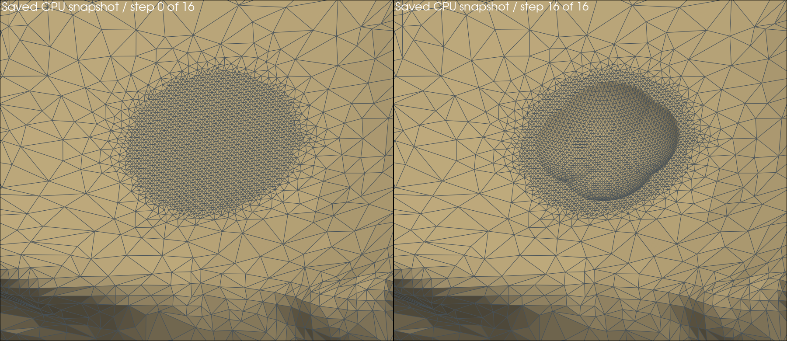
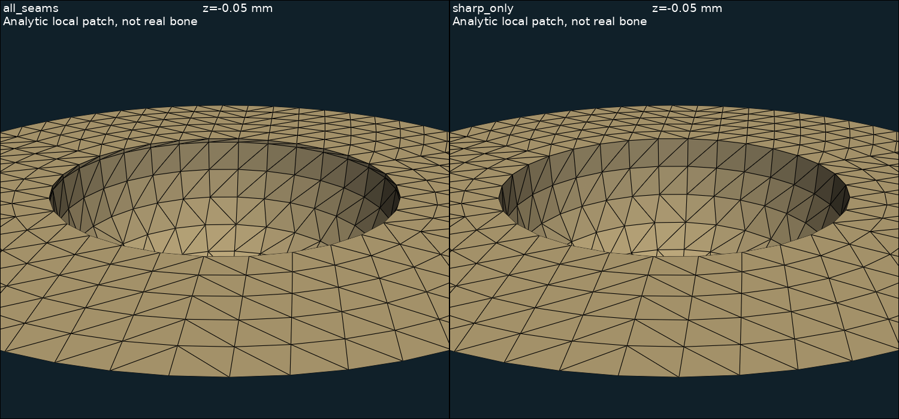
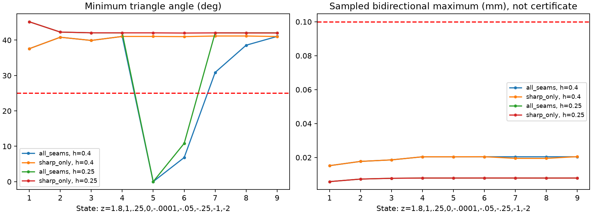
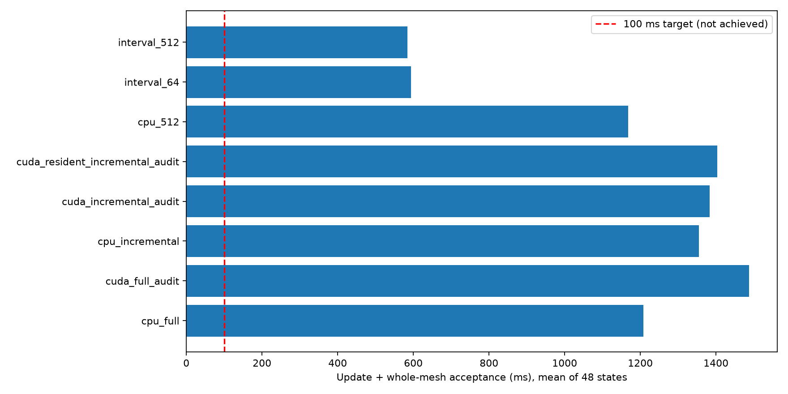
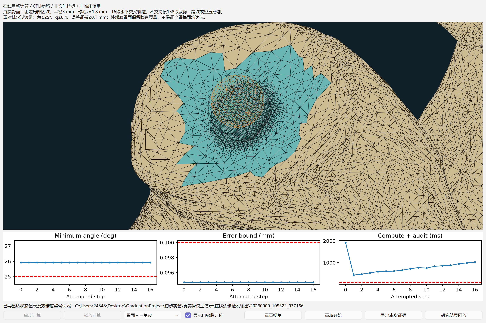

# 骨表面实时可视化研究阶段性汇报详细说明

> 生成时间：2026-09-15 01:49:00（北京时间）  
> 修改时间及修改内容：2026-09-15 01:49:00（北京时间），首次生成；核对v2三项研究、截至31号的实验、截图及HTML逐页映射。  
> 修改时间及修改内容：2026-09-15 01:54:15（北京时间），增加浏览器排版阅读版与小节跳转，保留MD原稿及研究内容。  
> 修改时间及内容：2026-09-15 02:07:45（北京时间），补充三项研究架构与计算流程示意图，与第2至4页对应。  
> 文档概述：面向导师的阶段性汇报详细稿，区分拟研究贡献、已验证结果及未完成事项，与同目录13页HTML内容对账。  
> 证据截止：现有项目31号记录（2026-09-09）；整理日期2026-09-15。

## 索引目录

- [1. 汇报定位与三项研究关系](#s1)
- [2. 研究一：几何约束下的骨面增量重建](#s2)
- [3. 研究二：时空协同的骨面实时可视化](#s3)
- [4. 研究三：不确定性感知的磨削状态表达](#s4)
- [5. 已完成工作与代表性实验证据](#s5)
- [6. 当前实施进展对账](#s6)
- [7. 文献依据与强基线准备](#s7)
- [8. 下一阶段关口与导师讨论重点](#s8)
- [9. 参考来源、图源与汇报页对照](#s9)

## 1. 汇报定位与三项研究关系

本次向导师汇报拟定的学术研究内容、技术依据、已有证据和下一研究关口。研究名称严格沿用根目录《研究内容.md》的v2版本。以“几何约束下的骨面增量重建”为主攻，“时空协同的骨面实时可视化”为系统层研究，“不确定性感知的磨削状态表达”为应用与验证层研究。三项不要求具有同等强度的独立算法创新。

对象为机器人辅助反式肩关节置换中的肩胛盂局部磨削，输入为CT重建三角骨面、术前计划与球形磨钻轨迹。工作一输出当前骨面及几何误差、质量信息；工作二输出带对应工具位姿、版本与时间信息的连续视觉反馈；工作三利用前两项信息解释剩余量、完成度与过磨风险，其状态字段再送入工作二显示。

证据截至项目现有31号报告（2026-09-09），汇报整理日为2026-09-15。没有把整理日写成新实验日期。本轮重渲染已有快照并复用已归档截图，未重跑CUDA、强基线或完整138段。当前总体结论是：已有受限几何验证、CUDA算子及验收管线优化、CPU在线载体；完整三维增量重建、实时端到端收益与不确定性方法贡献仍需验证。

建议汇报顺序为：研究关系、三项路线、代表实验、进展对账、下一关口。HTML共13页，建议讲述12–15分钟，具体论证与追问依据放在本文。

## 2. 研究一：几何约束下的骨面增量重建

### 2.1 学术问题与拟研究贡献

连续布尔容易留下碎小三角形；随后平滑或重网格又可能偏离目标骨面。核心问题是：如何在连续材料去除条件下，由目标几何直接约束局部网格生成，并同时控制三角形质量和新旧区域相容性？拟研究贡献是扫掠几何与网格质量协同的局部重建机制，现阶段尚无相对强基线的完整优势结论。

以初始骨实体B₀、第j段实际扫掠Sⱼ、计划允许裁剪区域Cⱼ定义目标：`Bₖ = B₀ \ ∪ⱼ≤ₖ(Sⱼ ∩ Cⱼ)`，目标表面为`∂Bₖ`。没有裁剪时省略Cⱼ。Mₖ表示其三角离散。该集合式是研究模型，并不表示现有代码已准确支持全部情况。目标状态取自原骨面及累计扫掠，避免把上一帧已变形网格作为唯一真值。

### 2.2 技术路线与论文依据

1. **目标几何及活动边界识别**：以原骨面、球形扫掠和计划裁剪共同确定更新目标，定位活动曲面及其交线。Geogram的精确CSG与OpenMeshCraft的交点解析提供鲁棒求交、共细分的已有方法依据与参照，均不自动保证每个三角形最小角达到25°。[R1][R2]
2. **受约束的局部离散**：区分必须保护的真实折线与无需强制保护的C1光滑连接；研究曲面内采样、边界共边和过渡带生成。31号仅对轴对称开放面提供有限消融证据。CGAL特征约束重网格文档作为工程背景，不替代本课题证明。[R6]
3. **误差与质量联合验收**：重建域及过渡带逐面检查最小角、q、退化、朝向，复核整骨拓扑和自交。已有受限目标为角≥25°、q≥0.4、局部误差证书≤0.1 mm。`q=4√3 A/(a²+b²+c²)`；这里a、b、c为边长，A为面积。阈值是项目实验门槛，不是临床安全线。
4. **独立对照与消融**：以解析曲面给真值，以Geogram加适用的质量维护构成竞争参照；分离目标状态、边界机制与采样策略的作用。失败、拒绝和未支持输入均计入统计。

### 2.3 可探索方向及可证伪判据

近期优先验证裁剪交线、短特征与质量约束的可行性，并接入真实骨面边界。若在相同几何预算下，候选不能改善最差单元或不能维持边界相容，则该机制不成立，应调整假设。随后探索动态扩域、非轴对称变深度轨迹；一般误差上界、终止条件与形状保证均需另作推导。

固定单高度图已退出完整任务唯一表示，只保留为适用域内的参照或加速模块。其支持单值投影、水平等高扫掠与固定底网；不能由134段“水平”分类推出这些段已受支持。普通等值面提取的解析8张网格中7张质量失败，说明加密隐式场本身没有解决质量生成问题（27号）。

### 2.4 当前完成边界

已形成受限真实骨面重建与整骨拼接，并有16步逐状态证据；31号对光滑连接与真实折线的区分提供初步机制支持。尚未完成原138段、真实骨面竖直磨削、一般动态重三角化、整体双向误差证明与强维护竞争。拒绝坏候选保障发布纪律，不等于能够完成所有输入。

## 3. 研究二：时空协同的骨面实时可视化

### 3.1 学术问题与拟研究贡献

磨削作用局部集中，几何验收耗时又随轨迹变化；若工具位姿、骨面和计划状态跨版本混用，显示会产生时序偏差。拟研究面向局部连续磨削的增量计算与一致性显示协同机制，在固定精度条件下协调空间工作量、更新频率与发布时机。CUDA为必做，GPU渲染不能替代GPU计算。

### 3.2 技术路线与论文依据

空间上按扫掠范围筛选活动区域，组织查询、更新、质量维护和状态计算，减少未变化区域重复处理。RXMesh 2025通过patch、cavity和冲突处理组织GPU动态网格操作，提供数据布局与并行局部更新的研究依据；本项目当前高度查询CUDA核并非RXMesh动态拓扑移植。[R3]

数值上在受限扫掠公式中使用向外舍入区间，把数值宽度计入既有误差预算，以独立CPU全查询和高精度公式验证。可靠过滤器研究及CUDA定向舍入指令为辅助依据，不能把针对特定谓词的定理直接扩展为磨削系统证明。[R7][R8]

时间上拟明确输入时间t_in、候选版本k、验收完成及显示时间t_display。发布的骨面Mₖ、工具位姿Pₖ、状态字段Fₖ应对应同一版本；显示滞后可记为`t_display−t_in(k)`，并单独记录与最新输入的差距。当前CPU窗口已有网格与刀位同版本交接，但完整状态字段同步、持续外部位姿输入与端到端测量仍待实现。

### 3.3 可探索方向与验证

依据实测瓶颈继续研究原面定位与证书查询并行化、稳定的细粒度复用、动态拓扑任务调度、计算与渲染交接。空间密度与时间步长自适应为候选，不预设为已定创新。任何减少更新频率都必须保持物理扫掠覆盖并报告显示滞后，不能漏算轨迹换取速度。

对照包括全量/局部、CPU/CUDA同精度、串行/协同显示；消融局部化、批量化、数值审计与调度。计时覆盖输入、计算、数据传输、同步、质量检查、状态计算、渲染及远程传输（如使用），报告均值、P95、P99、最大值与>100 ms比例。<100 ms是目标，60 fps仅是显示参考。

### 3.4 当前完成边界

25号受限区间管线约1.996倍加速，30号CPU受限在线接入与批量快照一致。二者是不同实验口径，尚未组成CUDA在线实时闭环。GPU一般动态拓扑、持续输入调度及完整端到端收益均未完成。

## 4. 研究三：不确定性感知的磨削状态表达

### 4.1 学术问题与拟研究贡献

单一深度色阶给出确定值，却没有表达配准、跟踪、几何更新及显示滞后如何影响“已完成”或“过磨”的判断。拟研究融合几何可信度与时间有效性的状态判定及视觉表达方法，输出带适用假设和可信范围的状态，而非预先承诺临床风险下降。

### 4.2 技术路线与论文依据

首先在统一计划坐标系确定剩余深度、计划内去除量、过磨和越界口径。计划比较须固定参考方向/符号，体积完成度与面积完成度不可混用。旧原型已有确定性量与显示，但新受限窗口没有沿用旧完整计划的完成度数字。

其次梳理几何误差、配准、工具标定与跟踪、延迟的来源及相关性。Gillmann等的CGF 2021综述提供医学图像处理和可视化中不确定性来源的分类与表达框架，是概念依据，不是本任务可直接复现的磨削算法。[R5]

对于仅有界的数据，用保守区间表达状态。一个待验证的局部模型是`d_true ∈ [d_hat−E, d_hat+E]`。在误差可转化为同一距离量、工具速度有上界且坐标变换条件成立时，可探索`E = E_geom + E_reg + E_track + v_max·Δt`。这仅是保守预算候选，旋转误差需按作用点杠杆臂转化，相关性和重复计入需单独处理，不能将其写成已完成误差传播定理。这里v_max为工具速度上界，Δt为状态滞后。

对于具有可校准概率模型的误差，再估计超限概率。确定性误差界不能称为95%置信区间。可探索在计划面叠加剩余量色阶、阈值附近的不确定区域和明确的滞后数值，使几何状态与其有效时间共同可见。

### 4.3 可证伪实验与当前进展

在有参考真值的序列中注入可控配准偏移、工具扰动和延迟，比较确定性色阶、固定安全带与不确定性感知表达。共同报告过磨漏报率、误报率、风险区域定位偏差、提示延迟及极端事件；有概率模型时增加校准度。固定随机种子、样本数及分布假设，必要时开展判断时间与识别正确率的小规模非临床评价。

当前只有框架与旧确定性显示载体，多源误差传播、可信范围、风险对照和用户评价均未完成。正式方法竞争仍需补充直接相关且满足等级条件的研究；综述不充当强算法性能对手。评价限定于仿真及所用数据，不作临床有效性承诺。

## 5. 已完成工作与代表性实验证据

### 5.1 E1：真实骨面受限16步与整骨拼接

19/20号建立联合重建及受限局部适用域，30号接入CPU在线窗口。下图由30号已保存的17张双精度整骨快照中第0和16状态重新渲染，使用同一视角和相同网格连边显示。未重算几何、未平滑、未以截图替代数值验收。原始数据为20260909_104833_851355，截图生成时间为2026-09-15 01:49:00（北京时间）。

图1：已保存真实骨面初态（左）与第16步（右）；受限局部轨迹，离线重渲染。

输入为单个真实CT肩胛骨、固定局部图域、半径3 mm球钻、球心z=1.8 mm的16段水平交叉轨迹。整骨22429顶点、44694面，17个含初态快照。验收包括重建域及过渡带角≥25°、q≥0.4、误差证书≤0.1 mm，以及整骨拓扑、自交报警及分离复核；外部原骨面保留既有质量。

| 指标 | 30号既定窗口样本 |
|---|---:|
| 接受/局部计划段 | 16/16 |
| 重建域含过渡带最小角 | 25.926351° |
| 最小q | 0.597729 |
| 最大受限误差证书 | 0.094709 mm |
| 最大顶点高度去除 | 1.197835 mm |
| 更新与验收均值 | 810.794 ms |
| P95 / P99 / 最大值 | 1086.704 / 1098.509 / 1101.460 ms |
| >100 ms比例 | 100% |

计时来自Intel Core Ultra 5 225H上的一次CPU窗口序列，16个轨迹步的经验分位数不是独立重复置信估计。计时排除初态、文件加载、渲染与图表绘制。证书是受限模型的误差证书，不是全骨任意曲面的Hausdorff结论。底网连接固定，不能称为一般动态重三角化。来源：[19号：边界过渡带联合重建与整骨逐步验收报告](../课题规划与专题调研/19-边界过渡带联合重建与整骨逐步验收报告.md)、[20号：局部适用域判据与核显双精度扫掠实验报告](../课题规划与专题调研/20-局部适用域判据与核显双精度扫掠实验报告.md)、[30号：受限逐步质量重建在线接入与界面验收报告](../课题规划与专题调研/30-受限逐步质量重建在线接入与界面验收报告.md)。

### 5.2 E2：覆盖检查促成表示路线收敛

26号在同一标本上做七组CPU/CUDA配对，共188次接受、4次拒绝、48段未执行。旋转、z=1.5 mm及同物理轨迹不同分段等五组全程通过；平移1 mm于第7段拒绝，边界轨迹首段拒绝。26号的z=1.5 mm通过更新了更早单配置的深度限制，不能把旧结论当普适深度下限。

原138段计划在首段适用域预检拒绝，没有完成138次合格更新。31号只做轨迹分类：134水平、4竖直，92段需要径向计划裁剪。水平分类不代表被旧图域覆盖；相邻给定段之间未定义的移动不自动补为扫掠。27号三维符号参照完成工具成员抽样一致性，尚未接真实骨面；普通等值面8张解析网格7张质量失败。因此固定单高度图退出完整任务唯一表示，继续研究活动曲面、裁剪交线与质量约束的协同生成。来源：[26号：真实骨面完整计划覆盖与强基线维护实验报告](../课题规划与专题调研/26-真实骨面完整计划覆盖与强基线维护实验报告.md)、[27号：核心表示路线决策与三维目标几何机制实验](../课题规划与专题调研/27-核心表示路线决策与三维目标几何机制实验.md)、[31号：原计划操作分类与竖直磨削分层曲面机制实验](../课题规划与专题调研/31-原计划操作分类与竖直磨削分层曲面机制实验.md)。

### 5.3 E3：竖直磨削分层机制与消融

解析目标为z≤0半空间上的轴对称凹坑，球钻半径R=2 mm，输出外半径4 mm的开放面。9个球心高度为1.8、1、0.25、0、−0.0001、−0.05、−0.25、−1、−2 mm；两档h=0.4/0.25 mm、两种机制，共36候选。

all_seams强制所有曲面连接成环；sharp_only只保护真实坑口折线，球底与圆柱侧壁的C1光滑连接沿连续子午弧长采样。短侧壁使强制双环间距离远小于周向边长，从而形成薄带差面。下图取c=−0.05 mm，左图坑口附近的额外极窄条带对应这一机制。

图2：31号既有结果截图；左为all_seams，右为sharp_only，均为解析开放面。

| 机制 | h/mm | 形状通过 | 最差最小角 | 最小q | 双向抽样最大距离/mm |
|---|---|---|---|---|---|
| all_seams | 0.4 | 7/9 | 0.013703° | 0.000414 | 0.020428 |
| sharp_only | 0.4 | 9/9 | 37.575250° | 0.750101 | 0.020524 |
| all_seams | 0.25 | 7/9 | 0.021901° | 0.000662 | 0.007908 |
| sharp_only | 0.25 | 9/9 | 41.999193° | 0.828194 | 0.007932 |

图3：31号36候选的形状及抽样距离曲线；形状通过不等于整体接受。

去除非特征光滑环后，两档共18/18候选通过形状检查；all_seams共14/18通过。h=0.4 mm下距离由0.020428略增至0.020524 mm，h=0.25 mm下由0.007908增至0.007932 mm，不能只报告角度改善。所有候选accepted=false，因为缺少整体误差、自交及真实整骨拼接验收。

距离为网格顶点/边中点/面心到解析有限目标，以及各目标曲面1024点的反向抽样；固定种子20260909。不同曲面等量采样的平均值不等于面积加权均值。图与表只能支持有限形状机制，不能推出严格整体双向距离界。来源：[31号：原计划操作分类与竖直磨削分层曲面机制实验](../课题规划与专题调研/31-原计划操作分类与竖直磨削分层曲面机制实验.md)。

### 5.4 E4：CUDA区间过滤与批量化

25号最终批次20260908_125526使用与E1对应的受限16段输入，远端同一RTX 4080 SUPER（云端报告）、CUDA12.8.93、Xeon8260、4线程预算。使用double，不以降低精度换速度。三方法各3轮×16步，正式144次更新通过；另有16步全查询CPU独立对拍，验证轮不进入加速比。

| 方法（同机、同输入） | 均值/ms | P95/ms | P99/ms | 最大/ms | 验收 |
|---|---|---|---|---|---|
| CPU，512面批次 | 1167.29 | 1734.19 | 1842.90 | 1867.69 | 48/48 |
| 区间CUDA，64面批次 | 593.97 | 633.71 | 650.40 | 655.30 | 48/48 |
| 区间CUDA，512面批次 | 584.72 | 612.63 | 630.25 | 631.59 | 48/48 |

区间512相对同期同批次CPU加速1167.29/584.72≈1.996倍。所有方法>100 ms比例均为100%。计时仅包括更新与整骨验收，不含GUI、计划字段、SSH传输或渲染，不能与30号本机CPU窗口的810.794 ms直接排名。

图4：25号归档计时图；缓存实验与区间最终实验分属不同批次，正式配对数据以上表为准。

机制解释：正式轮以向外舍入区间替换逐查询CPU镜像，并将数值宽度加入预算；另设独立全查询验证。最大区间宽度约1.776×10⁻¹⁵ mm，保存状态与CPU最大顶点差约1.332×10⁻¹⁵ mm，100位十进制公式覆盖300个点—历史组合均包含。这是条件性区间论证与有限数值检验，不是全系统形式化证明。

负结果同样保留：早期CPU镜像CUDA约1446 ms，慢于同期CPU约1192 ms；整批历史缓存每轮524次查询仅1次前缀命中，无净收益。最终区间64到512批次仅改善约1.56%，不能把主要收益都归于批量化。CUDA内核均值5.72 ms，整步584.72 ms，说明后续仍需定位CPU原面查询、证书及整骨复核费用；包含式计时不可直接相加。来源：[24号：真实骨面Geogram对照与CUDA逐状态接入实验报告](../课题规划与专题调研/24-真实骨面Geogram对照与CUDA逐状态接入实验报告.md)、[25号：CUDA区间过滤与查询批量化优化报告](../课题规划与专题调研/25-CUDA区间过滤与查询批量化优化报告.md)。

### 5.5 E5：受限在线窗口与状态交接

图5：30号最终复测窗口原始截图（20260909_105322_937166）；青色表示重建域及过渡带。

初态及每步先验收，再发布独立快照，刀位与网格同版本；拒绝即停，保留上一个合格显示。窗口支持播放、单步、暂停、重启、指标及结果回放。截图下部曲线包含初态，其计时尖峰不能并入上表16步更新统计；图5也不是810.794 ms既定样本的同一轮，不能混用复测与既定计时。

新增5项在线检查、既有联合6项和相机2项通过，16步与既有局部顶点快照一致。该成果是受限算法的CPU在线验证载体。新窗口没有沿用旧完整计划的完成度和过磨数字；CUDA尚未接入在线窗口，一般三维拓扑和真实工具流仍待完成。来源：[30号：受限逐步质量重建在线接入与界面验收报告](../课题规划与专题调研/30-受限逐步质量重建在线接入与界面验收报告.md)。

## 6. 当前实施进展对账

| 研究任务 | 目前实施进展 | 状态 | 尚需完成 |
|---|---|---|---|
| 一：受限骨面重建 | 整骨拼接及16步逐状态验收；原138段首段预检拒绝 | 受限验证 | 裁剪、跨域与一般动态质量生成 |
| 一：竖直磨削机制 | 36候选消融；sharp_only形状18/18通过 | 机制证据 | 整体误差、自交与真实骨面拼接 |
| 一：强算法对照 | Geogram连续诊断；RXMesh两组单次初跑 | 部分完成 | 强维护、公平精度与输出审计 |
| 二：CUDA计算 | 区间512批次584.72 ms；同期CPU1167.29 ms | 受限验证 | 完整管线与端到端实时性 |
| 二：一致性显示 | CPU在线16步；拒绝停止，网格与刀位同版本 | 载体已接入 | CUDA在线、持续输入与延迟统计 |
| 三：状态与风险 | 旧原型有确定性状态显示；v2方法框架已拟定 | 方法待验证 | 误差传播、可信范围与风险对照 |

“受限验证”表示指定数据与适用域已有证据，不表示研究完成；“机制证据”表示假设得到有限样本支持；“载体已接入”表示已连接显示流程；“方法待验证”表示尚无方法效果实验。没有按实验数量推算完成百分比。

表格与HTML第10页逐项一致。整体证据仍集中于一个真实CT标本，泛化性、长序列和跨域覆盖需补充。第三项的旧确定性原型与新的受限在线入口要分开叙述，不能混算状态指标。

## 7. 文献依据与强基线准备

### 7.1 正式对照及已运行状态

| 论文与等级依据 | 对照角色 | 当前证据 | 解释边界 |
|---|---|---|---|
| Geogram / TOG 2025 / A | 精确CSG与几何参照 | 两档16步诊断；维护链超时 | 更密工具采样误差优于本方法；未形成公平强维护结论 |
| OpenMeshCraft / TOG 2024 / A | 交点解析与共细分 | 论文、作者代码已归档 | 尚无本任务竞争结果 |
| RXMesh / TOG 2025 / A | CUDA动态拓扑与重网格 | 两组作者Remesh单次运行 | 905/928 ms内部计时；FP32且未完成输出审计 |
| PaMO / CGF 2025 / B | GPU无自交优化参照 | 论文、作者代码已归档 | 尚无本任务竞争结果 |

TOG为CCF-A、CGF为CCF-B，按项目22号2026-09-08的CCF官方目录核验记录，不额外声称某年度SCI分区。本轮2026-09-15复核论文/作者页面；CCF页面本次抓取失败，等级沿用有来源的项目记录，不能称为本次重新成功核验。论文与角色对应详见[R1]–[R4]。

Geogram的双精度I/O诊断采用17位有效数字，保留默认OBJ有损输出的初轮反例。两档16步布尔结果仍有形状问题，但更密工具的共同采样最大误差优于本方法；后维护适配链分别第12/10段超时不能归因于论文算法普遍劣势。RXMesh两组内部时间为904.540/927.811 ms，仅各一次，FP32/fast-math设置未构成项目FP64公平竞争，无输出质量/误差审计。

### 7.2 固定作者快照

| 方法 | 分支 | 归档提交 | 顶层许可（项目22号记录） |
|---|---|---|---|
| Geogram | main | 130442ff0f0c069d48ab4ebb4012218f3d861cf2 | BSD-3-Clause |
| OpenMeshCraft | mesh-arrangements | 2426961915583f21dcda919d1f33f861694079e8 | GPL-3.0 |
| RXMesh | main | e468c34ffabc70cd207309bce662d4821a9ed3b7 | BSD-2-Clause |
| PaMO | master | a10e34351eb7de71f41eb279e7ab9b2b101cf7a4 | AGPL-3.0 |

快照不等于论文实验精确提交。来源为[22号：高水平算法基线拉取清单与CUDA研究路线](../课题规划与专题调研/22-高水平算法基线拉取清单与CUDA研究路线.md)、[24号：真实骨面Geogram对照与CUDA逐状态接入实验报告](../课题规划与专题调研/24-真实骨面Geogram对照与CUDA逐状态接入实验报告.md)、[26号：真实骨面完整计划覆盖与强基线维护实验报告](../课题规划与专题调研/26-真实骨面完整计划覆盖与强基线维护实验报告.md)、[29号：播放视角保持修复与RXMesh远端续跑记录](../课题规划与专题调研/29-播放视角保持修复与RXMesh远端续跑记录.md)。没有在本轮更新第三方仓库或远端环境。

### 7.3 公平性要求

统一初始骨面、坐标系、mm单位、物理扫掠、工具离散误差、精度与质量阈值；分别比较CSG、质量维护和完整更新链。披露调参预算及FP32/FP64差异，验证初态、每步、拒绝和超时。既有2022鲁棒布尔保留为经典参照，但不作为唯一对手。第三项目前以综述建立概念框架，直接方法竞争仍需补齐。

## 8. 下一阶段关口与导师讨论重点

| 顺序 | 研究任务 | 进入下一关口的证据 |
|---|---|---|
| G1 几何机制 | 计划圆柱裁剪、真实折线、短特征与过渡带 | 解析真值下同时检查误差、形状、拓扑和自交，报告不可行情况 |
| G2 真实输入与强对照 | 真实骨面拼接、跨域/变深度；恢复强基线审计 | 按原138段逐段报告接受、拒绝、超时与未执行，不把分类算作运行 |
| G3 CUDA与显示 | 按瓶颈移植计算，接入版本一致显示 | 同精度CPU/CUDA对拍及完整端到端均值、尾部和超时率 |
| G4 状态风险 | 确定误差模型并注入扰动，比较表达方法 | 漏报、误报、区域定位与提示延迟；概率模型需校准 |

G1与G2是主攻关口；强基线恢复和CUDA瓶颈分析可并行准备，不能替代几何覆盖验证。第三项可先冻结状态定义与误差注入方案，不必等界面全部完成。这里是依赖顺序，不是未经工作量评估的交付日期承诺。

建议向导师重点讨论：是否继续保持第一项为主要算法贡献；是否以裁剪交线和质量协同生成作为下一可证伪假设；若原138段暴露不可行特征尺度，应如何界定适用域与研究范围。当前先保持原计划覆盖为验证任务，不自行缩减。

阶段性可陈述的结论：受限几何与在线交接已有可复现基础，CUDA数值审计优化取得受限收益，消融揭示非特征约束可能破坏网格形状。下一阶段核心是扩大几何覆盖、补强竞争证据，并验证完整时序及不确定性传播。

## 9. 参考来源、图源与汇报页对照

### 9.1 研究与实验来源

研究标题及定位以[研究内容.md](../研究内容.md)为准；实验执行规则见[18号：v2研究实验规划与学术验证规范](../课题规划与专题调研/18-v2研究实验规划与学术验证规范.md)。每个实验小节的项目报告链接保留原文，以便追溯输入、数学假设及原始日志。网页核验日期为2026-09-15；对[R1]–[R5]核对可访问的论文或作者来源，其余为已有项目引用，本轮不宣称新增复现。

- **[R1]** [Lévy. Exact predicates, exact constructions and combinatorics for mesh CSG. TOG, 2025.](https://doi.org/10.1145/3744642) [作者原文或代码](https://arxiv.org/abs/2405.12949)。精确CSG及目标几何参照；本轮作者预印本可访问，正式发表信息沿用22号。

- **[R2]** [Guo & Fu. Exact and Efficient Intersection Resolution for Mesh Arrangements. TOG 43(6), 2024.](https://mangoleaves.github.io/projects/mesh-arrangements/) [作者原文或代码](https://github.com/mangoleaves/OpenMeshCraft)。精确交点解析、局部化与共细分。

- **[R3]** [Mahmoud, Porumbescu & Owens. Dynamic Mesh Processing on the GPU. TOG 44(4), 136, 2025.](https://doi.org/10.1145/3731162) [作者原文或代码](https://github.com/owensgroup/RXMesh)。patch、cavity及GPU动态操作依据，非本任务的几何真值。

- **[R4]** [Oh et al. PaMO: Parallel Mesh Optimization for Intersection-Free Low-Poly Modeling on the GPU. CGF, 2025.](https://seonghunn.github.io/pamo/) [作者原文或代码](https://github.com/SarahWeiii/pamo)。无自交重网格、简化及安全投影，适配性待验证。

- **[R5]** [Gillmann et al. Uncertainty-aware Visualization in Medical Imaging – A Survey. CGF 40(3):665–689, 2021.](https://doi.org/10.1111/cgf.14333) [作者原文或代码](https://avida.cs.wright.edu/publications/pdf/J26.pdf)。第三项不确定性分类与表达框架；综述没有可直接竞争的磨削代码。

- **[R6]** [CGAL 6.0 Polygon Mesh Processing官方手册。](https://doc.cgal.org/6.0/Polygon_mesh_processing/index.html) 特征约束重网格工程背景，非本项目质量保证定理。

- **[R7]** [Fast floating-point filters for robust predicates. BIT, 2023.](https://link.springer.com/article/10.1007/s10543-023-00975-x) 可靠过滤数学辅助依据，沿用25号核验，不列为已核验等级的强竞争基线。

- **[R8]** [NVIDIA CUDA Math API：Double Precision Intrinsics。](https://docs.nvidia.com/cuda/cuda-math-api/cuda_math_api/group__CUDA__MATH__INTRINSIC__DOUBLE.html) 定向舍入技术契约，沿用25号记录，不替代独立数值验证。

等级来源：[CCF计算机图形学与多媒体官方目录](https://www.ccf.org.cn/Academic_Evaluation/CGAndMT/)，采用22号已核验记录，见§7.1。

### 9.2 图片原始来源

- **01-真实骨面初末状态截图.png**：源文件 [初步实验/真实骨模型演示/在线逐步验收输出/20260909_104833_851355/states.npz](../初步实验/真实骨模型演示/在线逐步验收输出/20260909_104833_851355/states.npz)。本轮读取已保存网格重新渲染，非新算法执行。

- **02-受限在线窗口截图.png**：源文件 [初步实验/真实骨模型演示/在线逐步验收输出/20260909_105322_937166/窗口验证.png](../初步实验/真实骨模型演示/在线逐步验收输出/20260909_105322_937166/窗口验证.png)。复用项目已归档原图，未改变实验内容。

- **03-光滑连接薄带消融.png**：源文件 [初步实验/竖直磨削曲面分层/实验结果/20260909_121752/光滑连接薄带消融.png](../初步实验/竖直磨削曲面分层/实验结果/20260909_121752/光滑连接薄带消融.png)。复用项目已归档原图，未改变实验内容。

- **04-分层机制质量与距离.png**：源文件 [初步实验/竖直磨削曲面分层/实验结果/20260909_121752/分层机制质量与距离.png](../初步实验/竖直磨削曲面分层/实验结果/20260909_121752/分层机制质量与距离.png)。复用项目已归档原图，未改变实验内容。

- **05-CUDA优化计时对照.png**：源文件 [初步实验/CUDA真实骨面对照/区间实验结果/20260908_125526/优化计时对照.png](../初步实验/CUDA真实骨面对照/区间实验结果/20260908_125526/优化计时对照.png)。复用项目已归档原图，未改变实验内容。

### 9.3 HTML页与本文位置对照

| HTML页 | 内容 | MD位置 |
|---|---|---|
| 1 | 封面与目录 | §1、§9.3 |
| 2 | 三项研究关系 | §1 |
| 3 | 研究一技术路线 | §2.1–2.4 |
| 4 | 研究二技术路线 | §3.1–3.4 |
| 5 | 研究三技术路线 | §4.1–4.3 |
| 6 | 真实骨面初末状态与受限验收 | §5.1–5.2 |
| 7 | 竖直磨削机制与消融 | §5.3 |
| 8 | CUDA受限性能 | §5.4 |
| 9 | 在线窗口与一致性交接 | §5.5 |
| 10 | 当前实施进展表 | §6 |
| 11 | 强基线准备与边界 | §7 |
| 12 | 下一阶段关口 | §8 |
| 13 | 核心参考文献 | §9.1 |

HTML支持左右方向键、空格翻页，Home/End定位，F全屏，N打开对应讲述备注。每页页脚标明MD章节，并打开由本文生成的[浏览器阅读版](03-阶段性汇报详细说明阅读版.html)，直接定位对应小节。阅读版提供返回当前汇报页及下载MD原稿的入口。HTML图片已内嵌，可单独离线放映；MD图片引用同目录“素材”文件夹，分享详细文档时须一并保留。查看原始项目报告则需保留相对项目目录。Edge无需Markdown插件。浏览器阅读版已内嵌图片，可离线打开；分发汇报时将01号幻灯片与03号阅读版放在同一目录。
